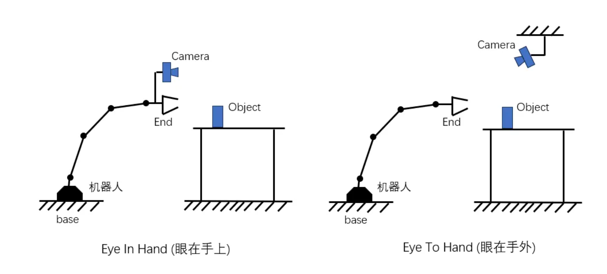

**机器视觉基础**

机器人若要在三维物理空间中执行精确操作（如抓取、装配、焊接），必须解决两个核心问题："我在哪里？"（定位）以及"物体在哪里？"（感知）。视觉传感器（相机）本质上是一个将三维欧氏空间（Euclidean Space）压缩投影为二维像素空间的变换器。这一过程伴随着深度的丢失与几何信息的畸变。

机器视觉的核心任务，即是这种投影过程的逆向工程——从二维图像恢复三维信息。这一过程高度依赖于对坐标系转换链条的精确描述。对于一个典型的视觉伺服系统，通过标定建立从像素坐标系到机器人基座标系的映射关系，是实现闭环控制的前提。本文将这一过程解构为三个层级：

成像几何（Imaging Geometry）： 描述光线如何穿过透镜并在传感器上成像（内参）。

刚体变换（Rigid Body Transformation）： 描述相机在世界坐标系中的位姿（外参）。

运动学耦合（Kinematic Coupling）： 描述相机与机器人末端执行器之间的相对关系（手眼标定）。

**空间坐标系变换体系**

理解视觉系统的前提是建立严谨的坐标系定义。在计算机视觉与机器人学中，我们通常涉及四个主要的坐标系。

**坐标系定义与层级**

**世界坐标系 (World Coordinate System,**
``` math
W
```
**)**

这是一个绝对参考系，通常由用户定义。在机器人工作单元中，它通常与机器人的基座标系（Base Frame）重合，或者是标定板所在的角点位置。其坐标表示为
``` math
P_{w} = T_{base}^{camera}
```
。它是所有测量的绝对真值基准。

**相机坐标系 (Camera Coordinate System,**
``` math
C
```
**)**

这是附着于相机光心的三维笛卡尔坐标系。根据标准针孔相机模型习惯（OpenCV标准）：

原点
``` math
O_{c}
```
：位于相机的光学中心（光心）。

``` math
Z_{c}
```
轴：沿光轴指向物体方向（深度方向）。

``` math
X_{c}
```
轴：平行于图像平面向右。

``` math
Y_{c}
```
轴：平行于图像平面向下。

其坐标表示为
``` math
P_{c} = \lbrack X_{c},Y_{c},Z_{c}\rbrack^{T}
```
。


当相机摆放如图所示时：

``` math
Z_{c}
```
轴：指向笔记本屏幕。

``` math
X_{c}
```
轴：指向照片的右侧。

``` math
Y_{c}
```
轴：指向照片的下方。

**图像物理坐标系 (Image/Film Coordinate System,**
``` math
I
```
**)**

这是位于相机焦距
``` math
f
```
处的连续二维平面。其原点通常位于光轴与图像平面的交点，即主点（Principal Point）。坐标单位通常为物理长度（如毫米）。坐标表示为
``` math
p' = \lbrack x,y\rbrack^{T}
```
。

**像素坐标系 (Pixel Coordinate System,**
``` math
P
```
**)**

这是经过模数转换（ADC）后的离散二维网格。

原点
``` math
O_{p}
```
：通常位于图像的左上角。

``` math
u
```
轴：向右延伸（对应列）。

``` math
v
```
轴：向下延伸（对应行）。

单位为像素（pixels）。坐标表示为
``` math
p = \lbrack u,v\rbrack^{T}
```
。

**坐标变换**

**世界坐标系-\>相机坐标系**

从世界坐标系到相机坐标系的变换属于欧氏群
``` math
SE(3)
```
变换，包含旋转和平移。为了将旋转和平移统一为线性矩阵乘法，引入**齐次坐标（Homogeneous Coordinates）。**

三维点
``` math
P = \lbrack X,Y,Z\rbrack^{T}
```
的齐次形式为
``` math
\overset{\sim}{P} = \lbrack X,Y,Z,1\rbrack^{T}
```
。

世界坐标
``` math
P_{w}
```
到相机坐标
``` math
P_{c}
```
的变换描述为：

``` math
\left\lbrack \begin{array}{r}
X_{c} \\
Y_{c} \\
Z_{c} \\
1
\end{array} \right\rbrack = \underset{外参矩阵}{\underbrace{\begin{bmatrix}
R & t \\
0 & 1
\end{bmatrix}}}\left\lbrack \begin{array}{r}
X_{w} \\
Y_{w} \\
Z_{w} \\
1
\end{array} \right\rbrack
```

其中：

``` math
R
```
是旋转矩阵。

``` math
t
```
是平移向量。

``` math
X_{c},Y_{c},Z_{c}
```
：是物体在相机眼里的坐标。

``` math
X_{w},Y_{w},Z_{w}
```
：是物体在世界（如机器人底座）里的坐标。

``` math
R
```
：是一个
``` math
3 \times 3
```
的旋转矩阵（Rotation），用来描述相机转了多少度。

``` math
t
```
：是一个
``` math
3 \times 1
```
的平移向量（Translation），用来描述相机移动了多少距离。

``` math
0_{1 \times 3}
```
：表示一行三个 0，即
``` math
\lbrack 0,0,0\rbrack
```
，这是数学上为了凑整矩阵用的。

在机器人学中，我们常通过正运动学（Forward Kinematics）获得末端执行器相对于基座的位姿，这与相机外参的物理意义一致，但方向定义可能相反（如相机在世界中 vs 世界在相机中）。混淆变换方向是工程实践中最常见的错误来源。它们描述的是同一个物理状态（相机和基座离得有多远，角度差多少），但是数学表达是相反的（互为逆矩阵）。

**位姿 (Pose)**：通常指
``` math
A
```
**在**
``` math
B
```
**中的位置**。

比如：相机在世界里的位姿 (
``` math
T_{world}^{camera\_ pose}
```
)。

这是机器人学的习惯。

**外参 (Extrinsic)**：通常指 **把**
``` math
B
```
**的坐标变换成**
``` math
A
```
**的坐标**。

比如：把世界点变成像素点 (
``` math
T_{world \rightarrow camera\_ coord}
```
)。

这是 OpenCV 的习惯。

**数学关系：**

``` math
\text{外参矩阵} = (\text{相机在世界中的位姿})^{- 1}
```

**3D 空间-\> 2D 图像**

在完成了从世界坐标系到相机坐标系(
``` math
SE(3)
```
刚体变换)的转换后，物体的位置仍然以三维坐标
``` math
P_{c} = \lbrack X_{c},Y_{c},Z_{c}\rbrack^{T}
```
表示（单位：mm/m）。

本节将讲解如何将这个三维坐标"压扁"并"离散化"，最终映射为计算机屏幕上的二维像素坐标
``` math
P_{pix} = \lbrack u,v\rbrack^{T}
```
(单位：pixel)。这一过程被称为**透视投影（Perspective Projection）**。

**理想针孔模型 (The Pinhole Model)**

最基础的成像模型是小孔成像。假设光线沿直线传播，穿过相机光心投射到物理成像平面上。

物理焦距 (
``` math
f
```
)：光心到成像平面的垂直距离（单位：mm）。

成像原理：根据相似三角形定理（Thales Theorem），三维空间点
``` math
P_{c}(X_{c},Y_{c},Z_{c})
```
在物理成像平面上的投影点
``` math
(x,y)
```
满足：

``` math
x = f\frac{X_{c}}{Z_{c}},y = f\frac{Y_{c}}{Z_{c}}
```

核心特性："近大远小"。公式中的分母
``` math
Z_{c}
```
体现了透视效果——物体距离相机越远(
``` math
Z_{c}
```
越大），其在像平面上的投影
``` math
(x,y)
```
就越小。

**离散化：从物理平面到像素平面**

计算机无法直接理解"毫米"，它只能理解"像素"。因此，我们需要将物理坐标
``` math
(x,y)
```
转换为像素坐标
``` math
(u,v)
```
。这一步引入了**相机内参矩阵 (Intrinsic Matrix)**。

**坐标系变换要素**

**缩放 (Scaling)**：物理尺寸 -\> 像素数量。

设感光元件上每个像素的物理尺寸为
``` math
dx \times dy
```
(mm/pixel)。

定义像素焦距：
``` math
f_{x} = \frac{f}{dx},f_{y} = \frac{f}{dy}
```
。

*注：对于现代方形像素传感器,*
``` math
dx \approx dy
```
*，故*
``` math
f_{x} \approx f_{y}
```
*。*

**平移 (Translation)**：中心原点 -\> 左上角原点。

物理成像平面的原点通常在图像中心。

像素坐标系的原点定义在图像左上角。

引入偏移量主点 (Principal Point)
``` math
(c_{x},c_{y})
```
，通常位于图像中心
``` math
(W/2,H/2)
```
附近。

**变换公式**

结合缩放和平移，得到最终的变换方程：
``` math
\left\{ \begin{array}{r}
u = f_{x}\frac{X_{c}}{Z_{c}} + c_{x} \\
v = f_{y}\frac{Y_{c}}{Z_{c}} + c_{y}
\end{array} \right.\ 
```

**矩阵形式（齐次坐标）**

为了便于线性计算，将上述非线性关系（因为有除法）写成齐次矩阵形式。引入缩放因子
``` math
Z_{c}
```
到等式左边：

``` math
Z_{c}\left\lbrack \begin{array}{r}
u \\
v \\
1
\end{array} \right\rbrack = \underset{\text{内参矩阵}K}{\underbrace{\begin{bmatrix}
f_{x} & 0 & c_{x} \\
0 & f_{y} & c_{y} \\
0 & 0 & 1
\end{bmatrix}}}\left\lbrack \begin{array}{r}
X_{c} \\
Y_{c} \\
Z_{c}
\end{array} \right\rbrack
```

**矩阵**
``` math
K
```
**中的参数解析：**

``` math
f_{x},f_{y}
```
：决定了相机的视场角（FOV）。数值越大，视场角越小（长焦）；数值越小，视场角越大（广角）。

``` math
c_{x},c_{y}
```
：图像的光学中心。由于组装误差，它可能不严格等于图像分辨率的一半。

**镜头畸变 (Lens Distortion)**

针孔模型是线性的理想模型，但实际相机的镜头（透镜）是由玻璃制成的，会产生非线性的光学畸变。在进行高精度测量或抓取前，必须修正这些误差。

**径向畸变 (Radial Distortion)**

由透镜形状引起，光线在远离透镜中心的地方弯曲程度不同。

桶形畸变 (Barrel)：图像边缘向内收缩（广角镜头常见）。

枕形畸变 (Pincushion)：图像边缘向外拉伸（长焦镜头常见）。

修正公式（Brown-Conrady 模型）：

``` math
x_{corrected} = x(1 + k_{1}r^{2} + k_{2}r^{4} + k_{3}r^{6})
```

其中
``` math
r
```
是点到中心的距离，
``` math
k_{1},k_{2},k_{3}
```
为径向畸变系数。

**切向畸变 (Tangential Distortion)**

由组装工艺引起，指镜头平面与感光元件平面不完全平行。

现象：图像一边清晰一边模糊，或物体位置发生梯形偏转。

修正系数：通常用
``` math
p_{1},p_{2}
```
表示。

在实际的机器人视觉开发（如使用 OpenCV + 奥比中光相机）中，从 3D 到 2D 的完整数学表达如下：

世界 -\> 相机 (外参变换)：

``` math
P_{c} = T_{ext} \cdot P_{w}
```

相机 -\> 理想归一化平面 (透视除法)：

``` math
x = X_{c}/Z_{c},y = Y_{c}/Z_{c}
```

畸变修正 (非线性变换)：

``` math
(x,y)\overset{\phantom{\text{畸变系数}D}}{\rightarrow}(x_{dist},y_{dist})
```

归一化平面 -\> 像素坐标 (内参变换)：

``` math
\left\{ \begin{array}{r}
u = f_{x} \cdot x_{dist} + c_{x} \\
v = f_{y} \cdot y_{dist} + c_{y}
\end{array} \right.\ 
```

**标定**

**张正友标定法**

张正友教授于1998年提出的基于平面棋盘格的标定法（A Flexible New Technique for Camera Calibration）是现代视觉系统的基石。其革新性在于无需昂贵的三维标定物，仅需一块平面图案在不同方位下的图像。

**单应性矩阵**

背景：世界坐标系是 3D 的
``` math
(X_{w},Y_{w},Z_{w})
```
，但在标定的时候，我们人为规定：棋盘格所在的平面就是世界坐标系的
``` math
Z = 0
```
平面。

``` math
Z_{w} = 0
```
，公式里的那一列直接乘以 0 消失了

``` math
\left\lbrack \begin{array}{r}
X_{w} \\
Y_{w} \\
\mathbf{0} \\
1
\end{array} \right\rbrack \rightarrow \text{第三列没了}
```

原本复杂的
``` math
3 \times 4
```
投影矩阵，变成了一个
``` math
3 \times 3
```
的矩阵，叫做**单应性矩阵 (Homography,**
``` math
H
```
**)**。

物理意义：
``` math
H
```
描述了两个平面之间的映射关系（物理世界的棋盘格平面 -\> 图片里的像素平面）。

怎么算：OpenCV 通过找棋盘格的角点，把图片上的点
``` math
(u,v)
```
和已知的棋盘格尺寸
``` math
(X,Y)
```
对应起来，就能把这个
``` math
H
```
算出来。

**利用"旋转的特性"反求内参**

困境：算出了
``` math
H
```
，但
``` math
H
```
是内参 (
``` math
K
```
) 和外参(
``` math
R,t
```
)混在一起的大杂烩 (
``` math
H = K\lbrack r_{1},r_{2},t\rbrack
```
)。我们要把
``` math
K
```
提炼出来。

突破口：利用旋转矩阵
``` math
R
```
的刚性约束。

旋转矩阵的列向量
``` math
r_{1}
```
(X轴方向) 和
``` math
r_{2}
```
(Y轴方向) 在 3D 空间里必然是：

相互垂直的（点积为 0）。

长度相等的（都是单位向量，长度为 1）。

求解逻辑：

把
``` math
H
```
拆开，用
``` math
K
```
和
``` math
h
```
表示
``` math
r_{1},r_{2}
```
。

强行让它们满足"垂直"和"等长"这两个条件。

这就会产生关于
``` math
K
```
的方程组。

为什么至少要 3 张图？

内参矩阵
``` math
K
```
里有 5 个未知数 (
``` math
f_{x},f_{y},c_{x},c_{y},s
```
)。

一张图片（一个
``` math
H
```
）只能提供 2 个方程（垂直、等长）。

所以需要 3 张图片：
``` math
3 \times 2 = 6
```
个方程，才能解出 5 个未知数。

**最大似然估计 (Bundle Adjustment)**

现状：上面的数学推导是假设“没有镜头畸变”且“找点完全精确”的情况下算出来的。但现实中相机有畸变，找角点也有误差。

优化：

初值：把上面算出来的
``` math
K
```
当作一个大概的初值。

目标：调整所有参数（内参、畸变、每一张图的旋转平移），让**"算出来的角点位置"和"实际找到的角点位置"**差距最小。

算法：Levenberg-Marquardt (LM算法)，这是一种非线性最小二乘法，可以理解为"数学上的自动对焦"，不断微调参数直到误差降到最低。

**ArUco码标定**

**手眼标定:**
``` math
AH = HB
```
**的数学与实践**

根据摄像头安装方式的不同，手眼标定分为两种形式：1.摄像头安装在机械手末端，称之为眼在手上（Eye in hand） 2.摄像头安装在机械臂外的机器人底座上，则称之为眼在手外（Eye to hand）



不管是眼在手上还是眼在手外，它们求解的数学方程是一样的，都为 AH=HB ，首先定义如下坐标系：

``` math
F_{b}
```
: 基座坐标系(Base Frame),固定在机械臂的底座上，是机械臂运动的全局参考坐标系。

``` math
F_{e}
```
: 末端执行器坐标系(End-Effector Frame)固定在机械臂末端执行器（例如夹爪或工具）上。

``` math
F_{c}
```
: 相机坐标系（Camera Frame）,固定在相机光心的位置，是视觉感知的参考系。

``` math
F_{t}
```
:标定目标坐标系（Calibration Target Frame）：固定在标定目标（如棋盘格、圆点板）上。

坐标系之间的关系通常用齐次变换矩阵（刚体变换）T表示：

``` math
T_{j}^{i} = \begin{bmatrix}
R_{j}^{i} & t_{j}^{i} \\
0 & 1
\end{bmatrix}
```

其中R ∈ SO(3)（旋转矩阵，特殊正交群）, t ∈ R³（三维平移向量）,分别对应旋转变换与平移变换。T的上下标表示变换是对于哪两个坐标系，例如:

``` math
T_{c}^{e}
```
:将相机坐标系转换到末端执行器坐标系的变换，也表示相机在末端执行器坐标系下的位姿，在眼在手上这种情形下，就是我们要求的目标矩阵。
