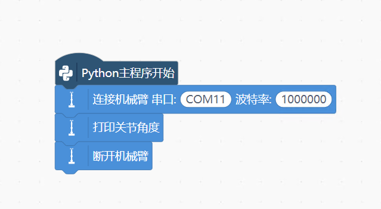
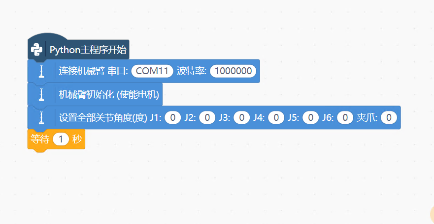
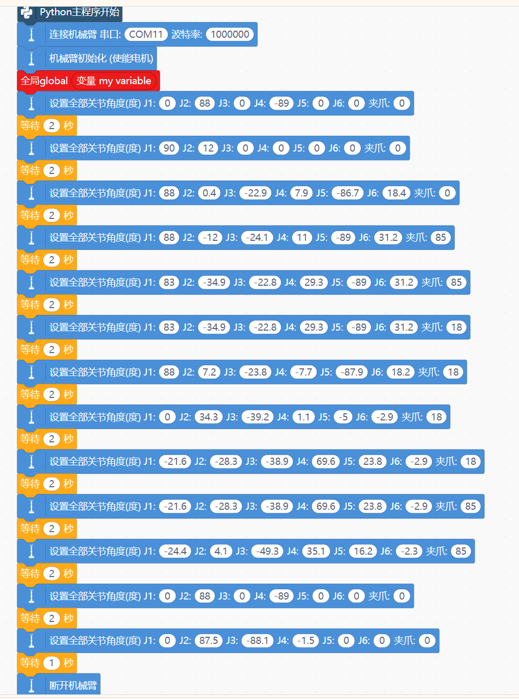
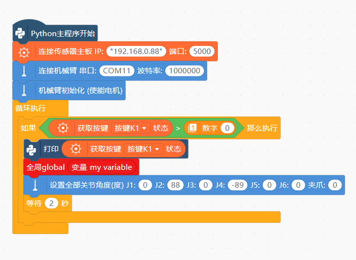
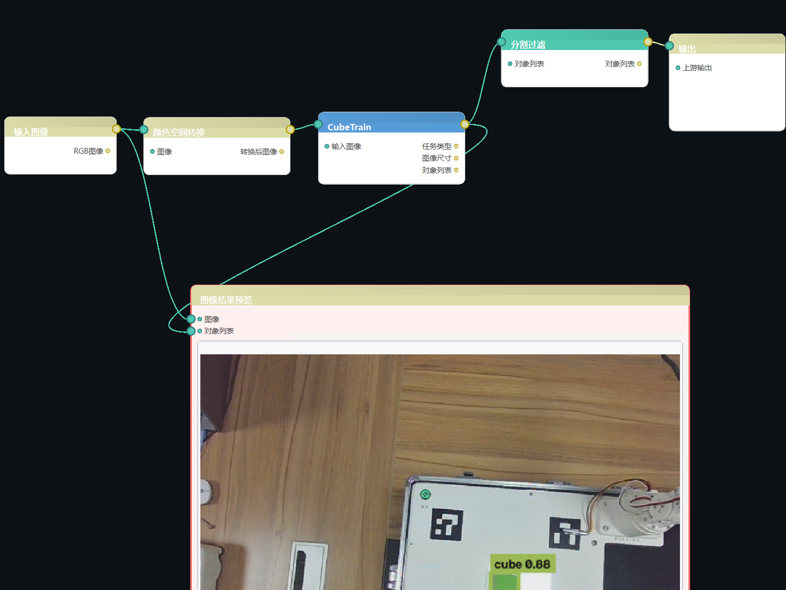

**AI02PRO图形化编程实验指导书**

**机械臂编程模块**

**1.获取机械臂关节角度**

Python 主程序开始 程序入口，所有积木从上到下顺序执行。

连接机械臂 串口：COM11，波特率：1000000 建立电脑与机械臂硬件的串口通信通道。

COM11：电脑识别到机械臂硬件的串口号，在电脑「设备管理器‑端口」查看；如果硬件插的不是 COM11，这里要修改，否则连不上。

波特率 1000000：通信速率，必须和机械臂固件参数完全一致，错一位就通信失败。

打印关节角度 核心调试积木。向机械臂读取 J1‑J6 六个关节当前真实物理角度，输出到程序日志窗口。

|  |
|:---|
| 用途： ①手动掰动机械臂到想要的姿态，运行这条积木，把日志里读出来的角度复制保存，就可以拿来填到 “设置全部关节角度” 积木，实现示教录点； ②验证机械臂通信是否正常； ③对比 “目标下发角度” 和 “机械臂实际角度”，看有没有位置偏差。 |

断开机械臂 程序执行完毕，关闭串口，释放 COM 口资源。

|  |
|:---|
| 提醒：如果程序忘记断开，异常强行停止程序，串口可能被占用，需要拔掉重插航插头，或者重启软件，才能再次连接。 |

**> 附：视频文件「20260820_104831.mp4」，请在 GitBook 中手动上传该文件。**

**\[获取机械臂端口.mp\]**

**2.控制机械臂动作回零点位置**

入门基础测试程序：完成串口连接、电机使能，控制机械臂所有 6 个关节运动到全部 0 度的姿态，动作完成后等待 1 秒。用来验证机械臂基础运动是否正常，常用于开机回零测试。

Python 主程序开始 程序入口，积木从上到下顺序执行。

连接机械臂 串口：COM11，波特率：1000000 打开电脑与机械臂之间 USB 串口通信通道。

|            |
|:-----------|
| 教学要点： |

COM11 要和电脑设备管理器中识别到的硬件端口号保持一致；

波特率1000000必须和机械臂固件参数完全匹配；

USB 硬件线必须提前插好，否则连接直接失败。

机械臂初始化 (使能电机) 给机械臂各个伺服电机上电使能。

设置全部关节角度 (度) J1:0 J2:0 J3:0 J4:0 J5:0 J6:0 夹爪：0 运动控制核心积木，一次性下发全部关节目标角度。

J1~J6：六个旋转关节全部设置目标角度为 0°；

夹爪：0：夹爪目标状态为闭合；

等待 1 秒 延时 1 秒。给机械臂留出运动时间，让机械臂有时间完成向 0° 姿态的运动。1 秒之后，如果后面没有积木，程序运行结束。

**> 附：视频文件「1e5dbbd657b1c2f504ef58c2f81590b9.mp4」，请在 GitBook 中手动上传该文件。**

**\[控制机械臂回零位.mp\]**

**3.控制机械臂抓取工件**

一、程序初始化（只运行一次，程序启动执行）

Python 主程序开始 程序入口，所有积木从此顺序执行。

连接机械臂 串口 COM11，波特率 1000000 建立电脑和机械臂硬件的串口通信通道。

|  |
|:---|
| 提醒：COM 端口号必须和电脑设备管理器保持一致，波特率必须匹配机械臂固件；选错串口，机械臂完全没有反应。 |

机械臂初始化（使能电机） 给机械臂电机上电使能。必须要有这一步！ 不执行初始化，后面所有角度指令电机都不会转动。

二、连续动作序列：多组「设置全部关节角度」+「等待延时」

|  |
|:---|
| 核心积木：设置全部关节角度(度) J1~J6，夹爪 一次性下发 6 个旋转关节 + 夹爪的目标角度数值。 |

J1‑J6：机械臂六个关节的目标角度；

夹爪：数值代表夹爪开合，数值小 = 夹爪张开，数值大 = 夹爪夹紧（例：0 张开，85 夹紧，18 松开）。

等待X秒：延时积木，让机械臂动作完成之后停留固定时间，给机械臂留出运动到位的时间。

我们把整套动作按业务逻辑划分：

第 1 组：J1:0 J2:88 J3:0 J4:-89 J5:0 J6:0 夹爪：0｜等待 2 秒 机械臂回到初始安全待命姿态

第 2 组：J1:90 J2:12 J3:0 J4:0 J5:0 J6:0 夹爪：0｜等待 2 秒 机械臂水平旋转，移动到工件上方高空位置，是接近工件的过渡位。

第 3 组：J1:88 J2:0.4 J3:-22.9 J4:7.9 J5:-86.7 J6:18.4 夹爪：0｜等待 2 秒，是接近工件的过渡位。

第 4 组：J1:88 J2:-12 J3:-24.1 J4:11 J5:-89 J6:31.2 夹爪：85｜等待 2 秒 机械臂准备小幅下沉，夹爪数值变为 85，打开夹爪

第 5 组：J1:83 J2:-34.9 J3:-22.8 J4:29.3 J5:-89 J6:31.2 夹爪：85｜等待 2 秒 夹爪保持打开

第 6 组：J1:83 J2:-34.9 J3:-22.8 J4:29.3 J5:-89 J6:31.2 夹爪：18｜等待 2 秒 移动到目标抓取位置，夹爪数值改为 18，夹爪加紧，抓取工件。

第 7 组：J1:88 J2:7.2 J3:-23.8 J4:-7.7 J5:-87.9 J6:18.2 夹爪：18｜等待 2 秒 夹爪保持，机械臂抬升，离开工作台面。

第 8 组：J1:0 J2:34.3 J3:-39.2 J4:1.1 J5:-5 J6:-2.9 夹爪：18｜等待 2 秒 机械臂回转，向原点方向移动。

第 9 组：J1:-21.6 J2:-28.3 J3:-38.9 J4:69.6 J5:23.8 J6:-2.9 夹爪：18｜等待 2 秒 机械臂摆动到另一侧过渡姿态。

第 10 组：J1:-21.6 J2:-28.3 J3:-38.9 J4:69.6 J5:23.8 J6:-2.9 夹爪：85｜等待 2 秒 夹爪松开。

第 11 组：J1:-24.4 J2:4.1 J3:-49.3 J4:35.1 J5:16.2 J6:-2.3 夹爪：85｜等待 2 秒 移动过渡姿态。

第 12 组：J1:0 J2:88 J3:0 J4:-89 J5:0 J6:0 夹爪：0｜等待 2 秒 回到最开始的初始待命姿态，夹爪夹紧。

第 13 组：J1:0 J2:87.5 J3:-88.1 J4:-1.5 J5:0 J6:0 夹爪：0｜等待 1 秒 机械臂运动到程序结束的收尾安全姿态。

三、程序收尾

断开机械臂 程序全部动作跑完之后，断开电脑和机械臂的串口连接，释放串口资源。

完整运行时序

程序启动 → 连接串口，电机使能

顺序执行一套预录关节角度：回原点→移动到工件上方→下探→夹爪夹紧抓取→抬升工件→移动到放料点→夹爪松开放件→多段姿态过渡→回到初始位→收尾安全姿态

全部动作完成，断开机械臂连接，整个程序到此运行结束，不会自动循环！

**> 附：视频文件「0d94a33ae534adfe1cdc91685e63d0f7_raw.mp4」，请在 GitBook 中手动上传该文件。**

**4.按钮控制机械臂动作**

这套程序实现效果：程序持续循环检测按键 K1，当 K1 被按下时，让机械臂运动到一组预设关节角度，之后等待 2 秒，再继续监听按键。 硬件链路：传感器主板检测按键 → 网络传给上位机程序 → 程序下发串口指令控制真实机械臂。

程序初始化部分（只运行 1 次，程序刚启动执行）

Python 主程序开始 程序入口，所有积木从这里开始跑。

连接传感器主板 IP:192.168.0.88 端口 5000

|  |
|:---|
| 橙色传感器通信积木 作用：网络连接按键所在的传感器主板。按键 K1 的信号，是通过这个网络连接读进来的。如果 IP / 端口写错，就完全读不到按键状态。 |

连接机械臂 串口 COM11，波特率 1000000

|  |
|:---|
| 蓝色串口积木 建立电脑和机械臂硬件的串口通信通道。COM 号要和设备管理器一致，波特率必须和机械臂固件匹配；串口选错，机械臂完全不会动。 |

机械臂初始化 (使能电机) 上电使能机械臂所有电机。这一步必不可少，不初始化，后面发角度指令电机也不会响应。

|     |
|:----|
|     |

循环执行积木（大黄色循环框，反复不停跑）

循环里面的代码会周而复始不断执行，作用是不停扫描按键有没有被按下。

|                                                                        |
|:-----------------------------------------------------------------------|
| 关键点：机械臂控制、按键检测几乎都要放在循环里，否则只会检测一次按键。 |

如果…… 那么执行：按键判断逻辑

条件：获取按键 K1 状态 \> 0

按键 K1 没有按下：返回数值 0；

按键 K1 按下：返回大于 0 的数值。

|  |
|:---|
| 逻辑：只要 K1 按键信号大于 0（也就是按键按下），就运行 “那么执行” 内部所有积木；没按下就跳过里面代码，回到循环开头继续检测。 |

“那么执行” 内部的积木（按下 K1 才执行）

打印 获取按键 K1 状态 把读到的按键数值输出到日志窗口。调试神器：按下按键看日志有没有数字输出，可以快速区分：是按键没读到？还是机械臂不动？

|  |
|:---|
| 调试小技巧：如果按 K1 日志始终是 0，问题出在网络连接 / 传感器主板；如果日志有数字但臂不动，问题出在串口、机械臂指令。 |

全局 global 变量 my variable 声明全局变量。

设置全部关节角度 (度) J1:0 J2:88 J3:0 J4:-89 J5:0 J6:0 夹爪：0

|  |
|:---|
| 核心动作积木！一次性给 6 个关节 + 夹爪下发角度指令 J1~J6 对应机械臂 6 个旋转关节，每个数字代表目标角度；夹爪 0 代表夹爪张开 / 闭合的目标值。 当 K1 按下，机械臂各个关节就会运动到这套角度姿态。 |

等待 2 秒 机械臂完成动作。

**\[按钮启动机械臂.mp\]**

**> 附：视频文件「28b4cf77c032e957bc5360d84a02d0cb_raw.mp4」，请在 GitBook 中手动上传该文件。**

**5.视觉识别PQDLK与机械臂联动**

1.读取相机图像

