# AI02proAIGC实验指导书

**AI02proAIGC实验指导书**

**一、ComfyUI 原理与节点工作流搭建基础**

ComfyUI 是一款基于节点式图形化界面的 Stable Diffusion工作流工具。相比传统的命令行方式或单一表单式界面，ComfyUI将图像生成的每一步都可视化为独立的“节点”，用户通过拖拽和连线即可构建完整的 AIGC生成管线。

这种方式尤其适合初学者学习 AIGC：一方面可以更直观地理解 AI图像生成的底层逻辑，另一方面也有助于培养结构化思维、参数调试能力和工作流设计能力。随着ComfyUI 生态的不断扩展，它已不仅能完成文生图，还能够支持图生图、图生视频、文生音乐、文生3D 等多种生成任务，成为学习多模态 AIGC 的重要平台。

**【学习目标】**

通过 ComfyUI 的实操，掌握 Stable Diffusion 图像生成的核心原理；

理解节点系统、数据流向、采样过程以及 VAE 编解码机制；

掌握文生图、图生图、图生视频、文生音乐、文生 3D 的基础工作流搭建方法；

学会根据不同场景调整参数，提高生成结果的稳定性与质量；

具备独立搭建、优化和复用 ComfyUI 工作流的能力。

**1.1 ComfyUI 核心运行原理**

**1.1.1 节点系统概述**

ComfyUI 的核心在于其图形化节点系统。每一个功能模块，例如加载模型（Load Checkpoint）、设置提示词（CLIP Text Encode）、采样器（KSampler）、保存图像（Save Image）等，都被抽象为一个独立的节点（Node）。

用户只需将这些节点拖拽到画布上，然后用“线”连接它们，就能清晰地看到数据是如何从一个节点流向另一个节点，最终生成图像。这种方式不仅让生成过程一目了然，也方便用户进行调试和修改。

节点式工作流的优势主要体现在以下几个方面：

透明化：生成过程一目了然，便于理解每一步的作用；

可调试：可以单独替换或调整某个节点，快速定位问题；

可复用：保存的工作流模板可以重复使用或分享；

可扩展：通过安装插件节点，可以快速接入新模型与新功能。

.png>)

**1.1.2节点的构成**

节点（Node）是构建任何工作流的基础元素，它代表了图像生成过程中的每一个独立功能或操作。你可以把节点想象成一个**可执行的积木块**，每个积木块都有特定的作用，比如加载模型、输入文本、处理图像，或者保存最终结果。

一个典型的节点主要由三部分组成：

.png>)

**点击图片可查看完整电子表格**

**节点数据流规则**

ComfyUI 每个节点是一个功能单元，遵循统一的接口规范：

**左侧圆点**：输入端口，接收来自上游节点的数据

**右侧圆点**：输出端口，将处理结果传递给下游节点

**连线的颜色**代表数据类型：紫色 = MODEL，黄色 = CLIP/CONDITIONING，粉色 = VAE，蓝色 = LATENT，白色 = IMAGE

以 Load Checkpoint 节点为例：它加载模型文件后，将自己拆解为 MODEL、CLIP、VAE 三部分，分别从右侧输出。这些输出将连接到后续节点的左侧输入：

.png>)

**点击图片可查看完整电子表格**

**1.1.3 基础工作流搭建实操**

**【学习目标】**

熟悉基础节点作用，掌握最小可用工作流搭建：将节点连接起来的过程，就是在构建一个完整而有逻辑的工作流。数据从一个节点的输出端口流出，进入下一个节点的输入端口，形成一个清晰的、可视化的处理路径。

以下是一个最基础的文生图工作流的数据流向：Checkpoint Loader（输出 MODEL/CLIP/VAE）→ CLIP Text Encode（正向/负向提示词编码）→ KSampler（采样去噪）→ VAE Decode（解码为像素图像）→ Save Image（保存）。

下面是基于工作流文字生成图片的展示。

.png>)

**【本章小结】**

本章介绍了 ComfyUI 节点系统的运行原理与数据流规则，详细讲解了 6 大核心节点（Checkpoint 加载器、CLIP 文本编码器、空潜空间图像、K 采样器、VAE 解码器、保存图像）的功能与关键参数，并通过最小可用文生图工作流的搭建实操，帮助学员建立从模型加载到图像输出的完整认知。学员应重点掌握节点间的数据流向（颜色对应规则）和 K 采样器的核心参数配置。

**二、文生图实战**

**【学习目标】**

理解文生图从文本到图像的完整生成逻辑（四步流程）

• 能够在 ComfyUI 中独立部署和运行文生图工作流

• 掌握提示词结构化编写方法与核心参数（steps/CFG/采样器/调度器/分辨率）的调优技巧

• 能运用文生图能力完成电商海报、人像写真等实际内容生产任务

**2.1 文生图生成机制原理**

Stable Diffusion 生成图像分为以下四个关键步骤：

步骤1：从随机噪声开始：生成过程的起点并不是一张空白画布，而是一张完全随机的潜在空间噪声图。你可以把这张图想象成一个充满了杂乱信号的“原始胚胎”，它没有任何可辨识的信息，就像电视机没有信号时的“雪花点”。

步骤2：逐步反向扩散：这是 Stable Diffusion 模型的核心去噪过程。模型会根据你输入的提示词（Prompt）和负面提示词（Negative Prompt），以及设定的各种参数（如步数、采样器等），一步步地从这张随机噪声图中“移除”噪声，并逐渐注入有意义的结构和细节。这个过程就像是雕塑家在杂乱的泥土中，根据脑海中的蓝图，一点点雕刻出清晰的轮廓和形态。经过多次迭代（每一步都称为一个“采样步”），最初的随机噪声最终会转化为一个具有清晰结构和内容的潜在空间图像。

步骤3：逐步去噪 去噪不是一步完成的。采样器（Sampler）会在噪声图上反复迭代，每一步去掉一点噪声、增加一点图像信息。经过设定的步数（如 20 步）后，噪声完全消失，图像内容显现。但此时的图像仍然是"潜空间"（Latent Space）中的压缩表示——人眼无法直接观看，尺寸也只有像素图的 1/8。

步骤4：VAE 解码：这个潜在空间图像是一个高度压缩的数据表示，我们肉眼无法直接识别。因此，需要使用 VAE（Variational AutoEncoder）模型对它进行解码。VAE 的作用是将其从抽象的潜在空间转换回我们熟悉的像素空间，还原出图像的真实色彩、亮度和细节。经过这个步骤，一张高质量的、可供查看的图片就此诞生。

.png>)

四个步骤与 ComfyUI 节点的对应关系：

.png>)

**点击图片可查看完整电子表格**

**2.2文生图基础工作流搭建**

\*\*【学习目标】\*\*会在 ComfyUI 中部署和运行文生图工作流。

在 ComfyUI 中，构建一个文生图（Text-to-Image）工作流就像是在拼装一幅电路图。你将一系列功能各异的节点连接起来，形成一个完整的数据流，最终生成你想要的图像。

以下是一个最基础、最常用的文生图工作流，它由五个核心节点组成：

|                    |        |                                   |
| :----------------: | :----: | :-------------------------------: |
|       **节点**       | **角色** |            **输入 / 输出**            |
| Checkpoint 加载器(简易) |  工作流起点 |  加载主模型文件，输出 MODEL、CLIP、VAE 三种关键数据 |
|     CLIP 文本编码器     | 文字控制入口 |  接收 CLIP 数据，将正向/负向提示词转换为模型可理解的编码  |
|        K 采样器       |  工作流心脏 | 接收 MODEL、文本编码、潜在图像，执行去噪采样，输出新潜在图像 |
|       VAE 解码器      |  图像还原  |     接收潜在图像 + VAE，解码为肉眼可见的像素图像     |
|        保存图像        |  工作流终点 |         接收像素图像，保存到电脑指定文件夹         |

如图所示

.png>)

**2.2.1搭建步骤**

启动Comfyui后，点击工作流后点击新建，即可新建一个空白工作流页面。

.png>)

在空白工作流页面双击或鼠标右键→ "新建节点"。

.png>)

.png>)

参照搭建好的工作流，第一个需要Checkpoint加载器(简易)。

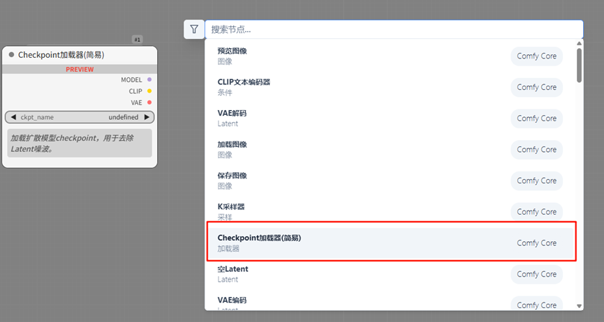

新建后即可在页面中查看到，节点会出现在画布上，显示三个输出端口（MODEL、CLIP、VAE）。

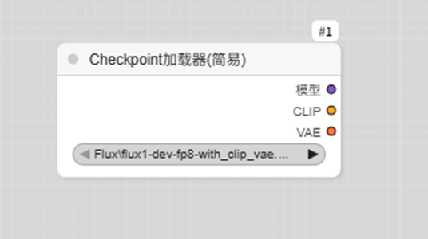

可以根据这个节点新建，也可以继续双击页面新建节点后连线。

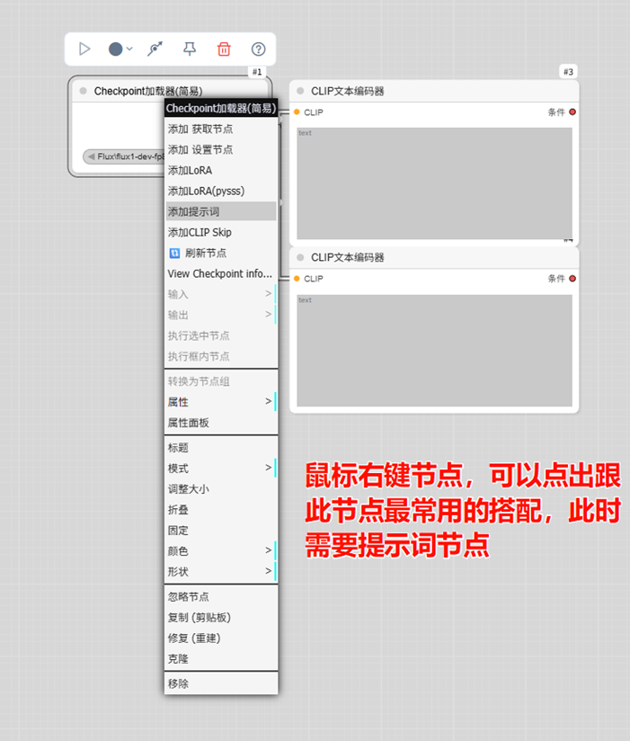

创建 CLIP 文本编码器：

双击空白处创建新节点，搜索 \*\*"CLIP"，\*\*选择 **"CLIP文本编码器"。**

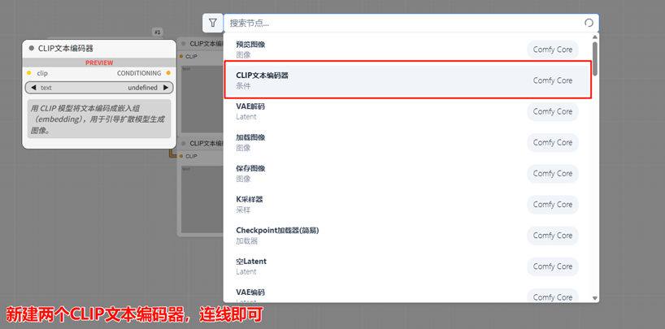

CLIP文本编码器创建完成后，即可加上正向和负向提示词

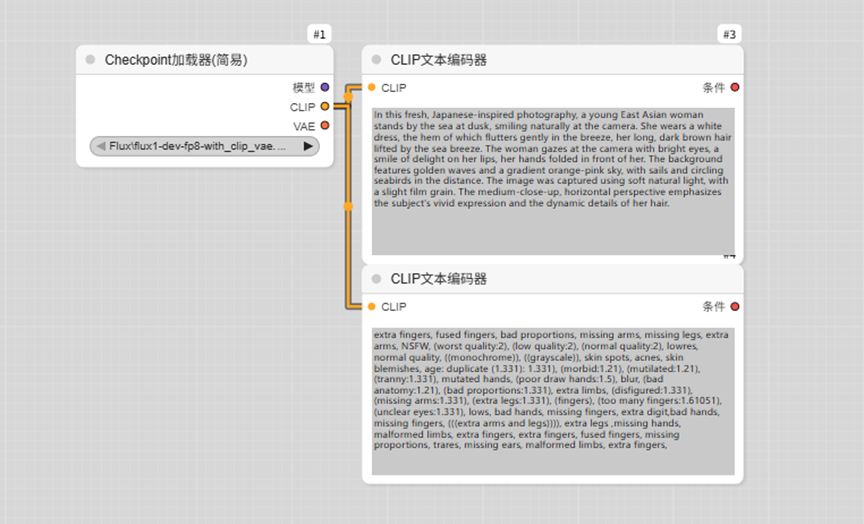

剩下节点（空 Latent、K 采样器、VAE 解码器、保存图像）可以以此创建出来

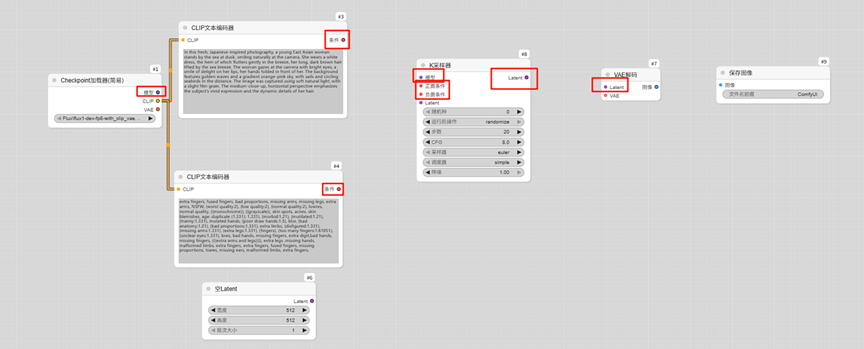

可以观察到，相同颜色的端口需要连接，如将 **Checkpoint加载器** 的 **CLIP** 输出（黄色） 连接到两个 **CLIP文本编码器** 的 **CLIP** 输入（黄色）。即可串联出一个完成的文生图工作流。

换成中文

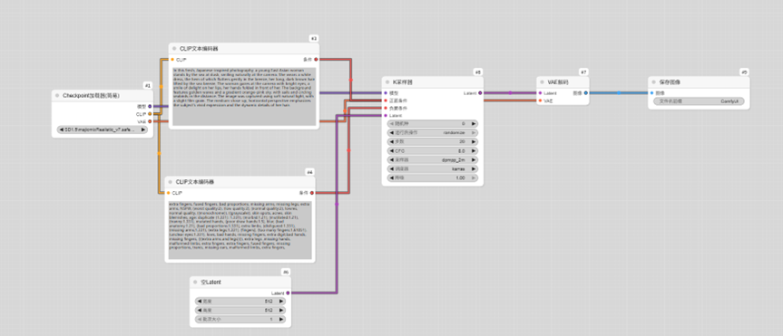

工作流搭建完成后，即可开始修改相应参数。点击相应模块即可。

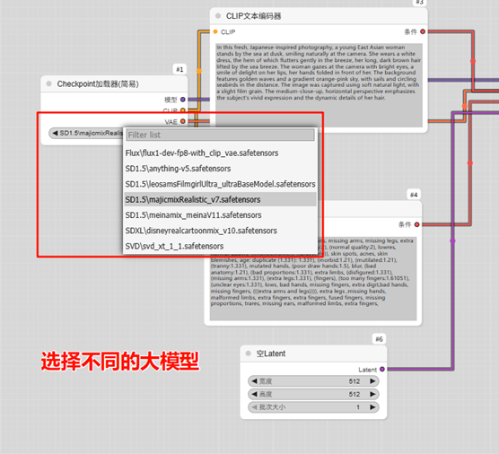

调整好自己想要的模型以及相应参数后，点击右上角的运行。

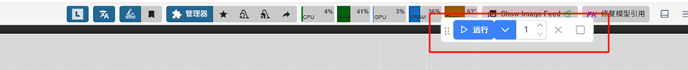

稍等片刻即可在队列历史中查看到。

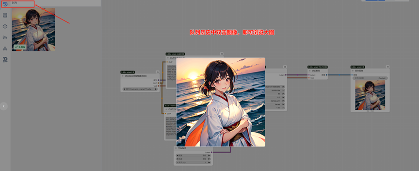

**2.3 文生图参数调优方法**

\*\*【学习目标】\*\*掌握影响图像质量的关键参数，质量由模型的选择和参数的调整决定：

**2.3.1文生图模型选择**

大模型是条件空间的核心，提示词是直接调用大模型的数据，因此大模型本身的训练数据越好，出图也会更好。

官方基础大模型存在缺点：细分特征弱（如生成东方古典人物时五官失真）、数据偏好偏差（默认偏欧美）、基础模型参数量大。

衍生大模型的特点（以麦橘写实为例）：数据适配（增加数万张亚洲审美女性写实数据）、数据优化（删除非亚洲/卡通数据）、模型优化（如 Flux Schnell 版通过时间步蒸馏将 120 亿参数压缩到 3GB 显存可运行）。

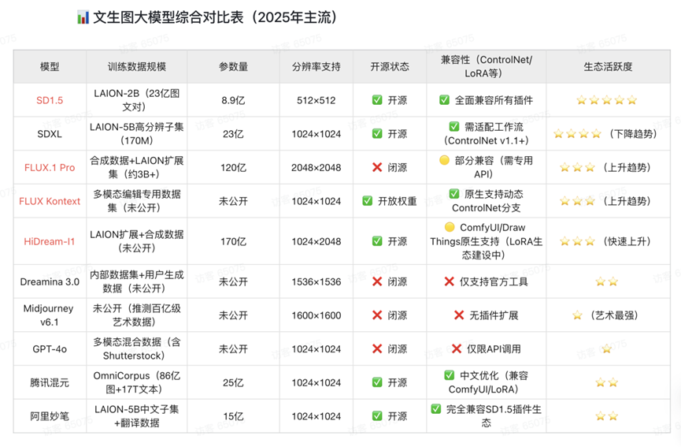

图比较测试：（提示词：Best quality, 1girl, smiling, long black hair, library, reading, sitting）

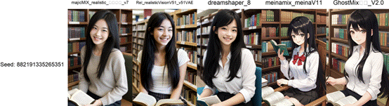

常用文生图模型选择对比：

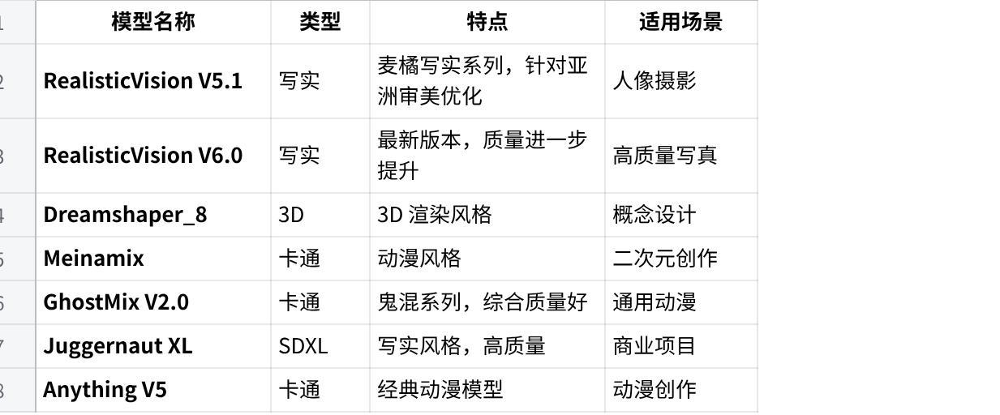

**点击图片可查看完整电子表格**

**2.3.2文生图提示词选择**

高质量的提示词不是“词库堆砌”，而是有结构、有层次地描述你想要的画面。推荐将提示词拆分为以下六个维度：

|        |               |                          |                                                |
| :----: | :-----------: | :----------------------: | :--------------------------------------------: |
| **维度** |    **英文参考**   |          **说明**          |                     **示例**                     |
|  主体描述  |    Subject    |  画面的核心是什么——人物、产品、动物、建筑等  |        1girl, red dress, long black hair       |
|  场景描述  | Scene/Setting |   主体所处的环境——室内、户外、海滩、城市等  |         standing on the beach at sunset        |
|  风格描述  |     Style     |  整体美术风格——写实、动漫、油画、3D渲染等  |  photorealistic, Japanese-inspired photography |
|  光影描述  |    Lighting   | 光线条件——自然光、演播室灯光、逆光、金色时刻等 |  soft natural light, golden hour, rim lighting |
|  镜头描述  |  Camera/Shot  |   拍摄视角与构图——特写、中景、全景、俯视等  | medium close-up, horizontal perspective, f/2.8 |
|  质量描述  |    Quality    |   画质提升词——高分辨率、杰作、细节丰富等   |   HDR, UHD, 8K, best quality, highly detailed  |

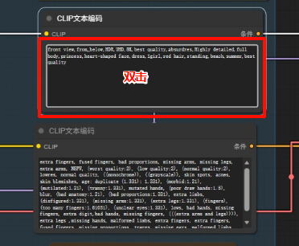

进入sixgodPrompt插件，进行填写相关提示词。

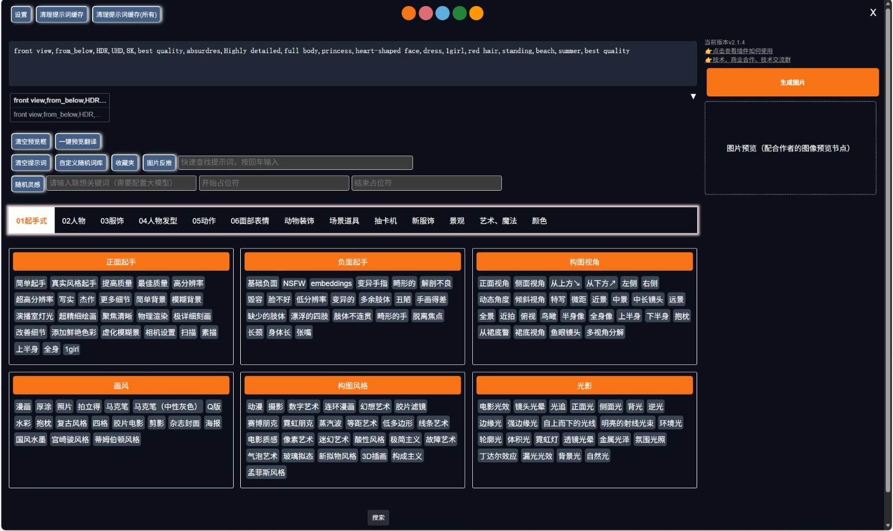

需要什么提示词直接进行点击即可，选择完成后，点击右上角叉号即可。

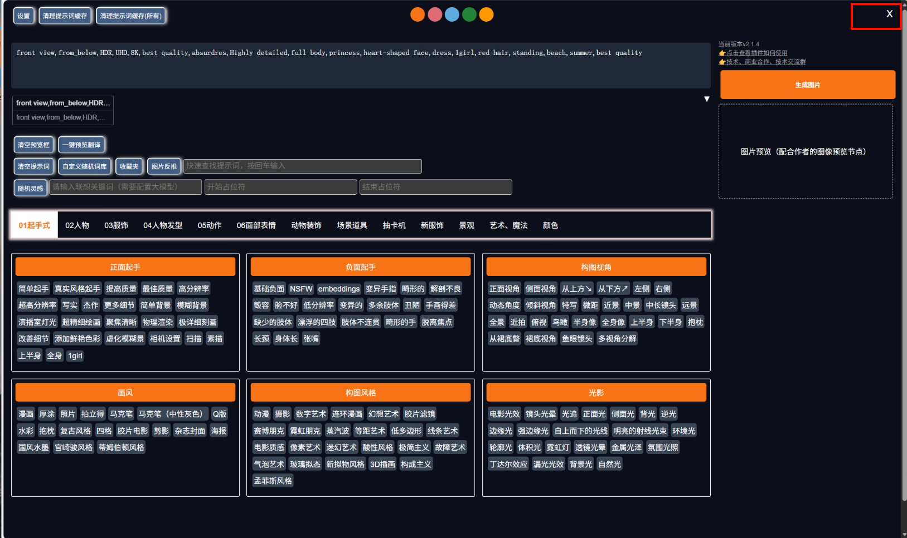

正向提示词（Positive Prompt）：用于告诉模型“我要什么”

，反向提示词（Negative Prompt）：用于告诉模型“不要什么”。

提示词模板 1：人物图

**【模板】主体 + 外观特征 + 场景 + 光影 + 风格 + 镜头 + 质量词**

【示例】1girl, wearing a white flowing dress, long dark brown hair lifted by sea breeze, standing by the sea at dusk, smiling naturally at the camera. Background features golden waves and gradient orange-pink sky, with seabirds in the distance. Soft natural light, slight film grain. Medium close-up, horizontal perspective. HDR, UHD, 8K, best quality, photorealistic.

提示词模板 2：电商海报

**【模板】产品主体 + 材质 + 背景环境 + 灯光氛围 + 商业摄影风格 + 高清细节**

【示例】A luxury perfume bottle with gold accents, crystal glass material, placed on a marble pedestal. Studio lighting with soft shadows, dark elegant background with subtle bokeh. Commercial photography style, product shot, clean composition. 8K resolution, hyper-detailed, sharp focus, professional lighting.

提示词编写实用技巧：权重控制(ctrl+键盘上键或键盘下键)：(word:1.5) → 提升权重；\[word] → 降低权重，当没有灵感时，可以双击CLIP文本编码模块。

**2.3.3K采样器参数选择**

K 采样器关键参数推荐由步数 (steps)即采样迭代次数、CFG Scale即提示词权重、采样器 (sampler)即去噪算法、调度器 (scheduler)、分辨率。

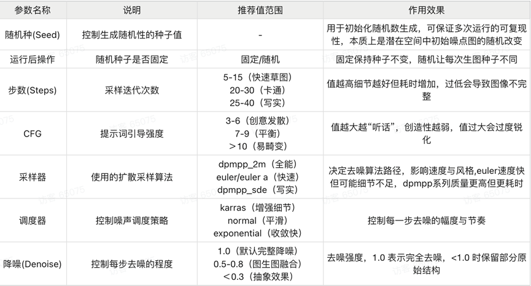

步数 (steps)即采样迭代次数，步数越多细节越丰富但耗时越长，推荐卡通 20，写实 30；以下图片为步数测试。

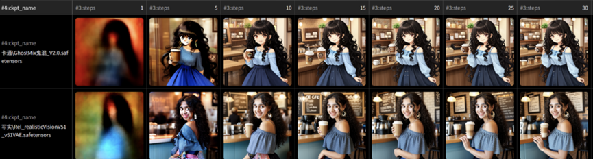

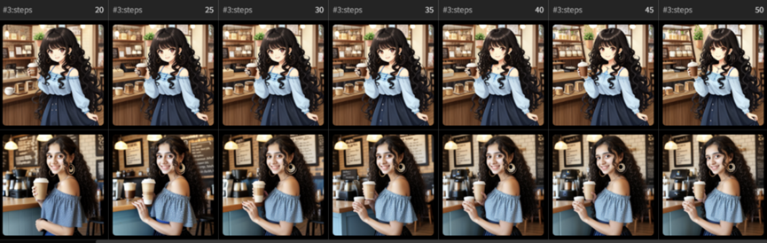

CFG Scale即提示词权重，控制模型对提示词的遵循程度，推荐7左右，以下图片为cfg测试。

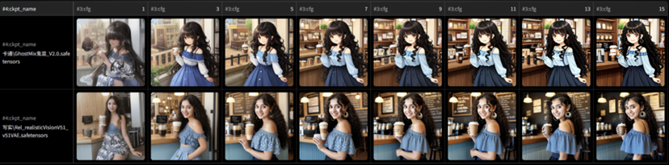

采样器 (sampler)即去噪算法，dpm++ 系列为现代主流（取代落后的 ddpm），推荐dpmpp\_2m。

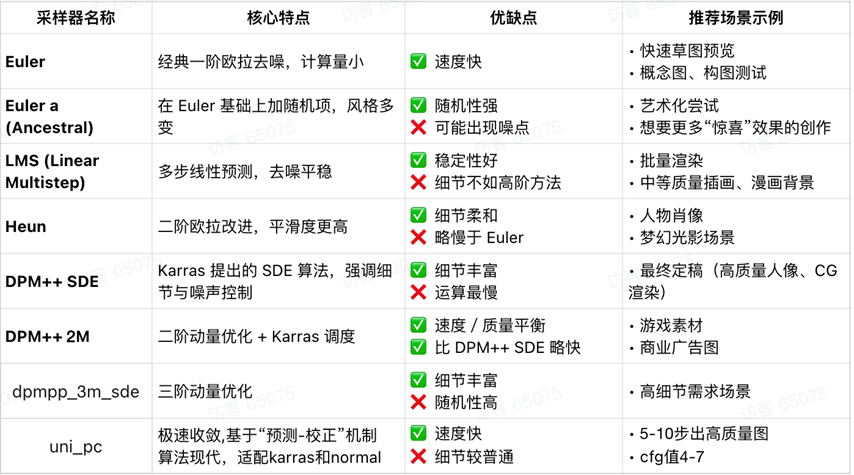

调度器 (scheduler)控制每步去噪强度变化，推荐karras

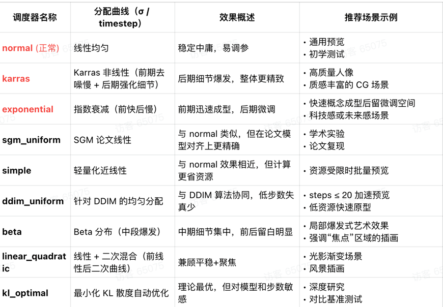

分辨率，空laten节点sd1.5建议分辨率最佳为512\*512，部分sd1.5模型用了768分辨率的训练数据，所以也可以512\*768组合。如果使用其他模型可以查阅相关内容，找到合适的分辨率。

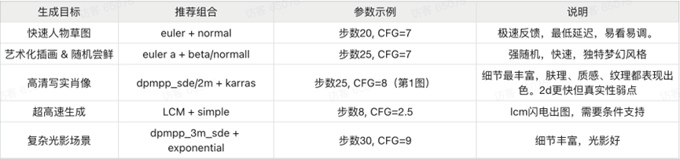

\*\*实战常用搭配：\*\*采样器 dpmpp\_2m + 调度器 karras，兼顾质量与速度，是社区最主流的组合。

**2.4 文生图应用场景实操**

\*\*【学习目标】\*\*能将文生图能力应用到实际内容生产中

场景1：电商产品海报生成。使用商业摄影风格的提示词模板，搭配写实类模型（如 RealisticVision），生成高质量产品展示图。提示词重点放在产品材质、灯光氛围和商业摄影风格上。

场景2：人像写真风格图生成。使用人物图提示词模板，搭配亚洲审美优化的写实模型（如麦橘写实系列），生成自然风格的人像写真。提示词重点放在人物外观特征、场景和光影上。

**2.5 效率加速与 LoRA 基础**

LoRA（Low-Rank Adaptation）是一种微调模型，大模型控制生成图片的整体风格，LoRA 仅调整部分参数来注入特定风格或角色特征。

LoRA 的使用方式分为两种：单独加载、堆叠组合。对于复杂多 LoRA 场景，推荐使用 LoRA Manager 插件（comfyui-lora-manager）来简化管理和 trigger word 自动注入。

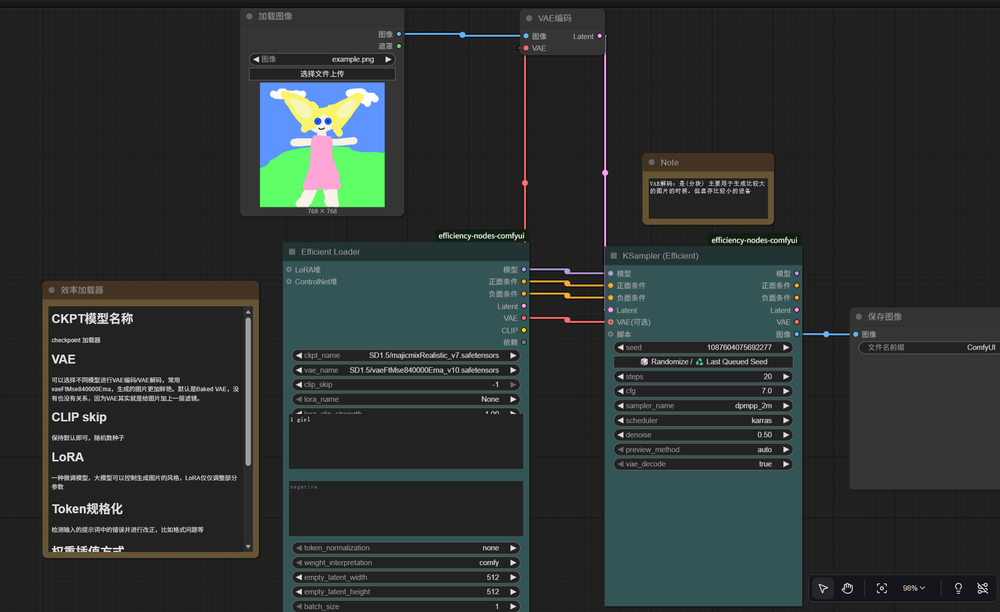

• LoRA 单独加载

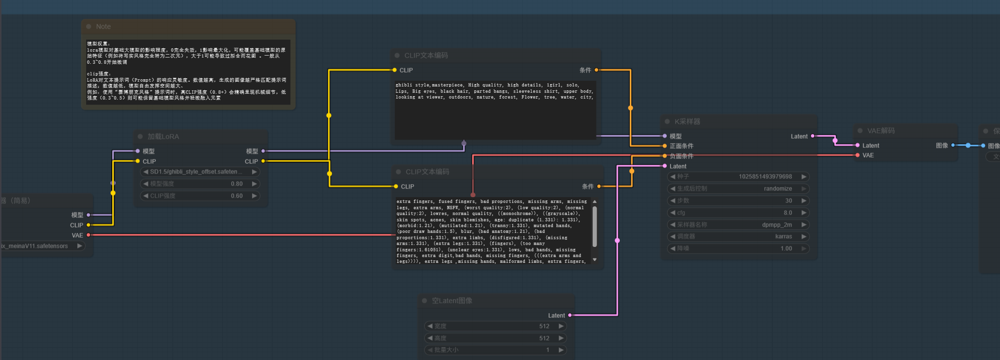

• LoRA 堆叠组合：如果在生成图片时需要多个LoRA微调模型的配合时使用

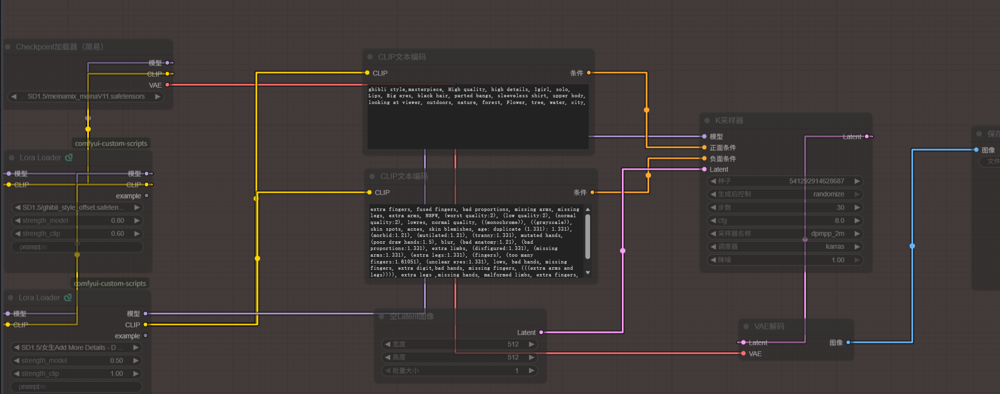

•LoRA Manager 插件

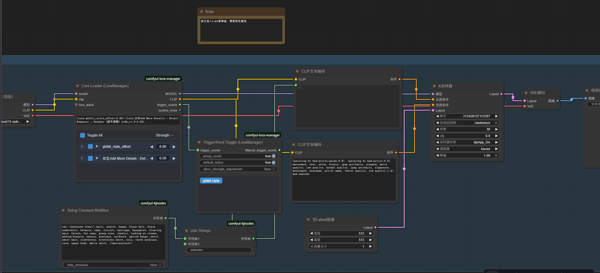

常用 LoRA 使用场景：

• 角色一致性：同一角色在不同场景中保持面部和服饰一致

• 风格注入：如吉卜力风格、水墨画风格等特定美术风格

• 细节增强：如手部细节改善、皮肤质感提升等

使用方式：在 Checkpoint 加载器后连接 LoRA 加载节点（如 LoraLoader），选择 .safetensors 格式的 LoRA 文件，调节模型强度（通常 0.5-1.0），再将输出的 MODEL 和 CLIP 接入后续节点。多个 LoRA 可通过 LoRA 堆（LoRA Stack）节点组合叠加使用。

**【本章小结】**

本章围绕文生图的核心流程展开，介绍了从随机噪声到图像输出的完整生成逻辑。学员需要重点掌握：提示词结构化编写方法（主体/场景/风格/光影/镜头/质量六维度）、K 采样器核心参数（steps/CFG/采样器/调度器/分辨率）的调优技巧，以及 LoRA 微调模型的使用方法。这些能力是后续图生图与视频生成的基础。

**三、图生图实战**

**【学习目标】**

• 理解图生图（img2img）的工作原理，掌握 denoise 参数对结果的影响规律

• 能够搭建图生图工作流，完成风格迁移、修复增强等任务

• 掌握 ControlNet 线稿提取与上色技术，以及图像放大与高清修复方法

• 能够完成线稿转插画、模糊图修复、照片转动漫等综合实操项目

**3.1 图生图工作原理**

文生图是从“随机噪声”凭空生成图像，而图生图（Image-to-Image，简称img2img）则是以一张已有图像为起点进行二次创作。这张已有图像可以是自拍照片、手绘草图，或是 AI 生成的初稿。模型会在保留原图部分特征的基础上，根据提示词重新生成画面。图生图的过程同样遵循 Stable Diffusion 的去噪逻辑，但起点不同，可分为以下四个关键步骤：

\*\*步骤1 加载并编码原图：\*\*通过 Load Image 节点导入参考底图，再用 VAE Encode 节点把像素图像“压缩”回潜在空间表示。这与文生图末尾的 VAE 解码正好是相反的过程。

\*\*步骤2 按比例添加噪声：\*\*模型对这张潜在图像施加噪声。注意——这里不是加满噪声，而是根据“重绘幅度（Denoise）”参数决定加噪的比例。Denoise 越大，加噪越多，原图信息被覆盖得越多。

\*\*步骤3 反向扩散去噪：\*\*在提示词引导下，模型从“原图 + 部分噪声”的混合状态开始迭代去噪，重新生成细节。此时生成的内容既受原图结构影响，又受提示词引导。

\*\*步骤4 VAE 解码输出：\*\*将最终的潜在图像解码为像素图像并保存。

**3.2 图生图工作流搭建**

图生图工作流与文生图类似，但有一个关键差异：文生图使用 Empty Latent Image 作为输入，而图生图使用 Load Image + VAE Encode 得到LATENT 作为输入。

搭建要点：

• 用“加载图像”节点导入参考底图（支持拖拽上传）

• 用“VAE 编码”节点将像素图像编码为 LATENT

• 将 VAE 编码输出的 LATENT 连接到 K 采样器的 latent\_image 输入

• K 采样器的 denoise 参数必须小于 1.0，否则等同文生图

• 灵活应用 VAE 编解码器实现图片转绘——不同 VAE 模型对编码/解码的色彩风格有影响

**3.3 图生图工作流理解**

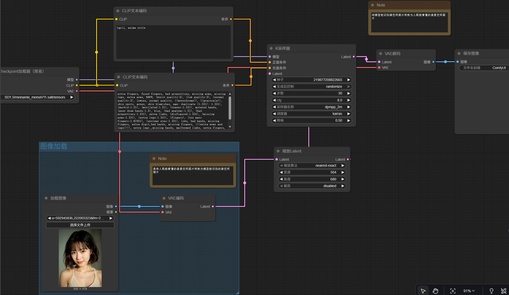

图生图工作流的本质，是用“原图经编码后的潜在数据”替换掉文生图中的“随机噪声”。各节点的角色如下：

**•** Load Image——参考图入口：导入像素底图，输出 IMAGE 数据。它是图生图的“起跑线”。

**•** VAE Encode——图像转潜空间：把像素图像压缩回模型能处理的潜在空间表示。相当于 VAE 解码的逆运算。

**•** K 采样器——核心引擎：此时它接收的不再是纯噪声，而是“原图 + 部分噪声”，因此 denoise 参数成为决定性变量。

**3.4重绘幅度（Denoise）参数调优**

如果说提示词是“告诉模型画什么”，那么重绘幅度就是“告诉模型改动多大胆”。这是图生图中最关键、最需要反复调试的参数，取值范围 0\~1。下表是经过实测的取值区间与适用场景：

**表 5-3 重绘幅度取值区间与适用场景**

|               |                    |           |                     |
| :-----------: | :----------------: | :-------: | :-----------------: |
|    **重绘幅度**   |       **效果**       | **原图相似度** |       **适用场景**      |
| 0.1 \~ 0.3（低） |    几乎不动，仅轻微修复或微调   |     极高    |     去噪、修复瑕疵、微调光影    |
| 0.4 \~ 0.6（中） | 保留构图与主体，改变风格/细节/配色 |     较高    | 风格转换（照片→油画/动漫）、强化画质 |
| 0.7 \~ 0.9（高） |    大幅改写，仅保留大致轮廓    |     较低    |    大幅改绘、基于草图的二次创作   |
|     1.0（满）    |  等同文生图，原图信息几乎完全覆盖  |     极低    |    实际很少使用，失去图生图意义   |

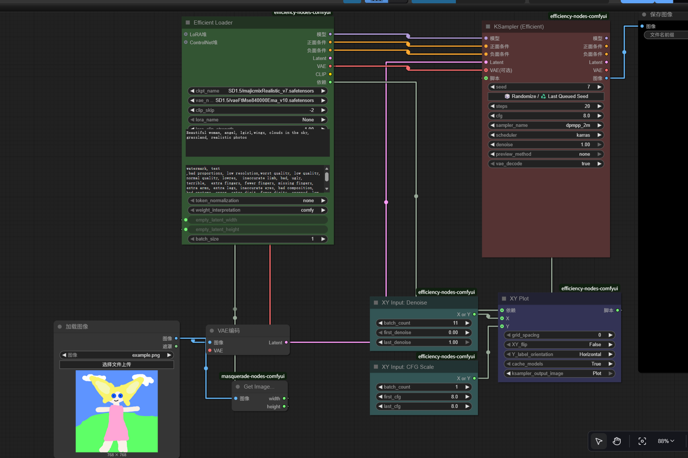

实操建议：初次尝试从 0.5 起步，观察效果后“边调边看”地迭代——偏高则减少，偏低则增加，逐步逼近理想效果。

**3.5图生图提示词与实操技巧**

|          |             |                                  |
| :------: | :---------: | :------------------------------: |
| **应用场景** | **denoise** |             **提示词要点**            |
|  照片转动漫风  |  0.5 \~ 0.6 |     写明目标风格（anime style）+ 色调描述    |
|   老照片修复  |  0.2 \~ 0.3 | 保持原描述，加入“high quality, detailed” |
|   线稿上色   |  0.7 \~ 0.9 |        描述目标配色与材质，因线稿信息少需大改       |
|   画质增强   |  0.3 \~ 0.4 |          复用原提示词，强调清晰度关键词         |

实操技巧：

• 参考图选择：底图越清晰、构图越明确，图生图效果越稳定。模糊或杂乱的底图会干扰模型判断。

• 尺寸匹配：Load Image 的尺寸最好与原空 Latent 分辨率一致（如 512×512），否则 VAE 编解码可能出现比例失真。

• 迭代调试：不要指望一次成功。固定提示词、只调 denoise，能最快摸清“改动力度”与效果的对应关系。

**【项目1：图生图放大】**

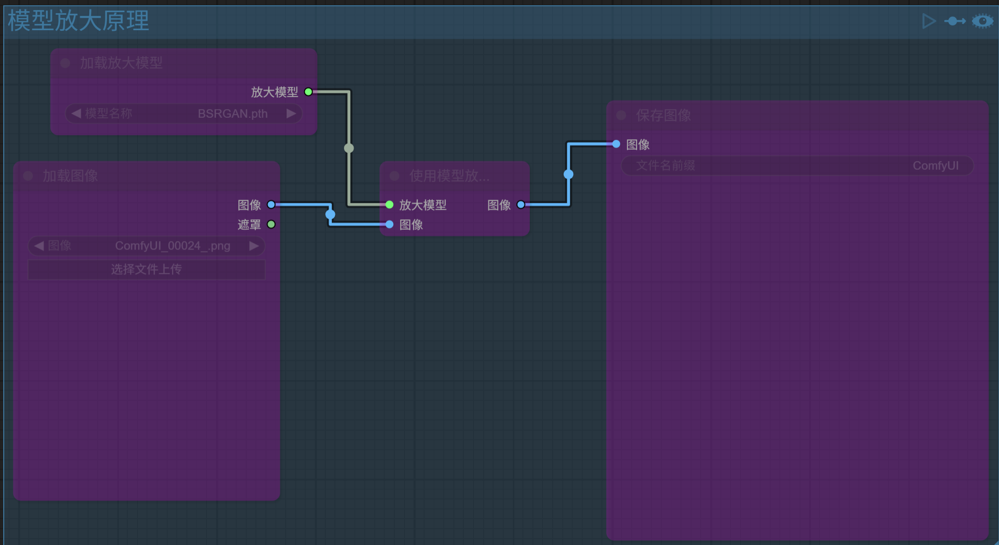

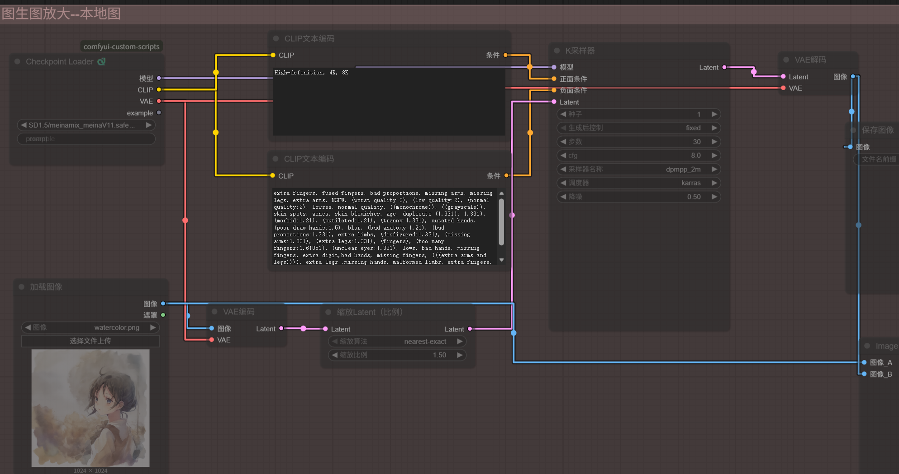

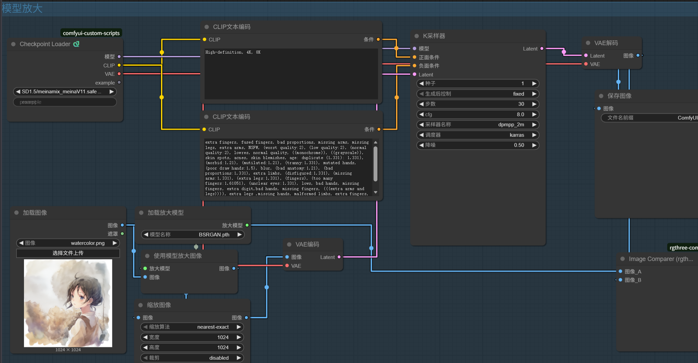

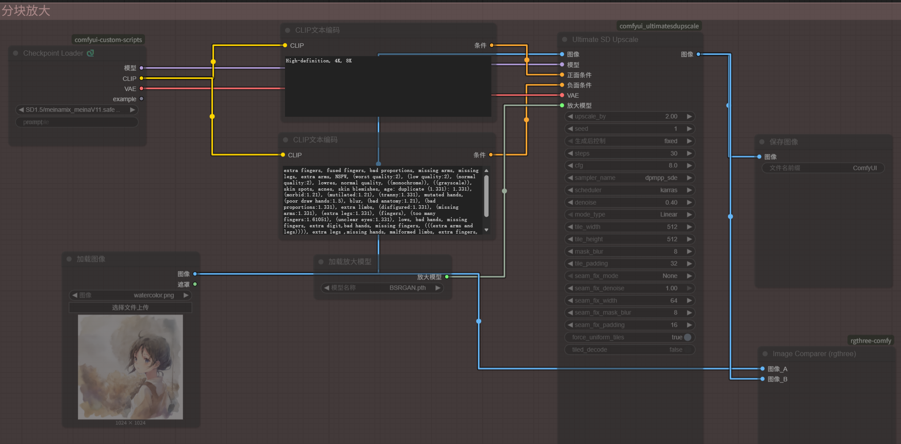

**【项目2：脸部修复】**

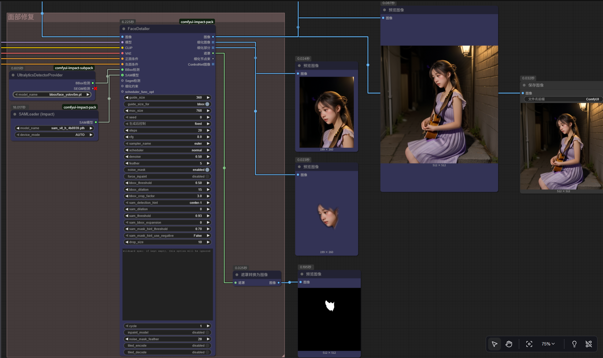

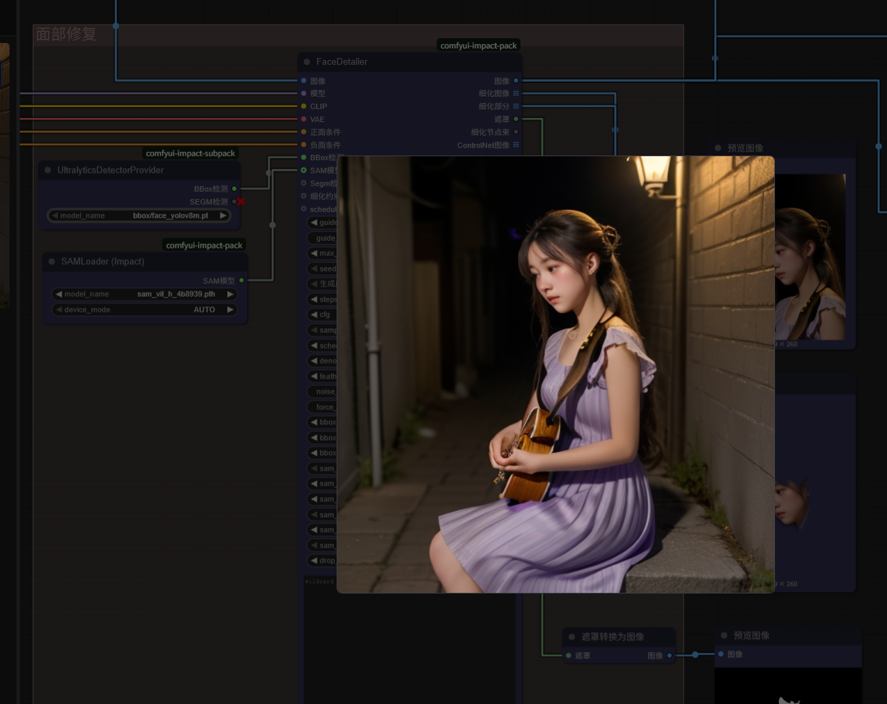

**【本章小结】**

本章深入讲解了图生图的工作原理，重点围绕 denoise 参数展开调优方法。并内置了线稿上色（ControlNet 约束 + 高 denoise 生成）与图像放大修复（Upscale + Tiled VAE + 轻量修复）等工作流，帮助学员建立完整的图生图应用能力。

**四、图生视频实战**

**【学习目标】**

• 理解 Wan2.2 模型的 DiT 架构原理

• 能够搭建基于 Wan2.2 的图生视频工作流，掌握核心节点链的连接方式

• 掌握运动幅度、噪声强度、采样步数、帧率等关键参数的作用与调优方法

• 能够完成从单张静态图到 2-4 秒短视频的完整输出流程，并处理常见问题

**4.1 图生视频工作原理**

前面章节生成的都是静态图像。图生视频（Video Generation）则是在静态图像基础上引入“时间维度”，让画面动起来。在 ComfyUI 生态中，Wan2.2 是阿里通义实验室推出的基于 DiT（Diffusion Transformer）架构的视频生成模型。与传统的 UNet 架构不同，Wan2.2 将 Transformer 的序列建模能力引入扩散模型，在视频生成任务上展现出更强的时序一致性和画面质量。

与文生视频工作流对比区别在于在静态图像基础上操作。

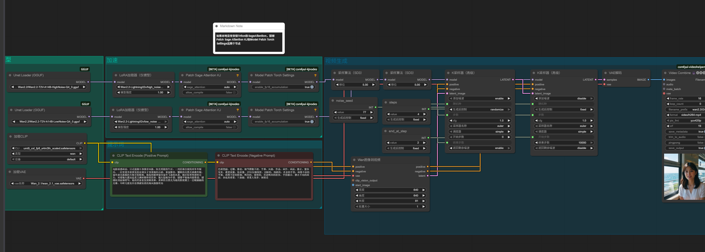

**4.2 Wan2.2 原理解析**

Wan2.2 在图生视频任务上的能力边界如下，学员在实际使用前应对这些限制有清晰认知：

• 分辨率支持：支持 480P（832×480）和 720P（1280×720）两种主流分辨率。输入图像的宽高比应与目标分辨率一致，否则可能出现画面拉伸变形

• 帧数范围：单次生成支持 33~~81 帧（Wan2.2 版本决定上限）。以 16fps 帧率计算，可产出的视频时长约为 2~~5 秒

• 显存需求：480P 约需 12~~16GB VRAM，720P 约需 20~~24GB VRAM。显存不足时可通过降低帧数、减少采样步数或启用 offload 模式来适配

• 输入图像要求：建议使用清晰、无模糊的高质量图片，分辨率不低于 480P。模糊或低质量的输入图会导致视频中出现大面积的噪声和伪影。

**4.3 图生视频工作流搭建**

基于Wan2.2 图生视频的完整节点链如下：

Load Image（加载图像）→ CLIP Vision Encode（CLIP 视觉编码）→ Wan2.2 Model Loader（Wan2.2 模型加载）→ Wan2.2 Sampler（Wan2.2 采样器）→ Wan2.2 VAE Decode（Wan2.2 VAE 解码）→ Save Video（保存视频）

各节点的功能说明和连接方式如下：

节点1——Load Image（加载图像）：从本地磁盘选择输入图像，支持 PNG、JPEG、WebP 等常见格式。该节点输出 IMAGE 数据，直接连接到 CLIP Vision Encode 的 image 输入口

节点2——CLIP Vision Encode（CLIP 视觉编码）：使用 CLIP 模型将输入图像编码为特征向量。该向量作为视觉条件注入到后续的 Wan2.2 Sampler 中，指导视频生成与输入图像在内容和风格上保持一致。CLIP Vision 模型（如 clip-vit-large-patch14）需事先下载并放置于 ComfyUI/models/clip\_vision/ 目录

节点3——Wan2.2 Model Loader（Wan2.2 模型加载）：加载 Wan2.2 的 DiT 模型权重文件和对应的文本编码器。该节点输出 MODEL 数据。Wan2.2 的 DiT 模型权重（.safetensors 格式）需从官方渠道下载并放置于 ComfyUI/models/diffusion\_models/ 目录

节点4——Wan2.2 Sampler（Wan2.2 采样器）：核心推理节点，接收 MODEL、CLIP Vision 编码结果、文本提示词等多路输入，执行反向扩散过程生成视频潜空间（LATENT）。所有关键参数（运动幅度、噪声强度、采样步数、CFG、帧数、种子等）均在此节点中配置

节点5——Wan2.2 VAE Decode（Wan2.2 VAE 解码）：使用 Wan2.2 自研的 3D VAE 将潜空间数据解码为像素视频帧序列。该节点输出 IMAGE（多帧），需连接到 Save Video 节点进行最终渲染

节点6——Save Video（保存视频）：将多帧图像序列合成为视频文件并写入磁盘。需设置输出路径、帧率（fps）和编码格式（推荐 H.264 MP4）。

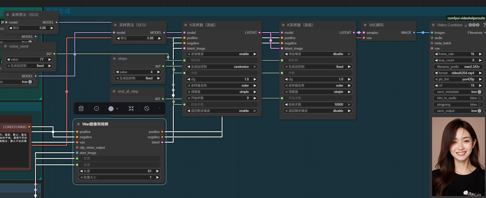

**4.4 完整节点参数配置表**

|                     |                  |                              |                                |
| :-----------------: | :--------------: | :--------------------------: | :----------------------------: |
|       **节点名**       |      **参数**      |            **推荐值**           |             **说明**             |
|      Load Image     |       image      |            选择本地图片            |        输入图像建议 720P 以上清晰度       |
|  CLIP Vision Encode |   clip\_vision   |    clip-vit-large-patch14    |       需加载 CLIP Vision 模型       |
| Wan2.2 Model Loader | diffusion\_model | wan2.2\_t2v\_14B.safetensors |         DiT 模型，约 14B 参数        |
|    Wan2.2 Sampler   |       steps      |            20\~30            |       采样步数，DiT 架构对步数敏感度较低      |
|    Wan2.2 Sampler   |        cfg       |           5.0\~7.0           |      CFG 引导强度，Wan2.2 推荐较低值     |
|  Wan2.2 VAE Decode  |        vae       |          Wan 3D VAE          | Wan2.2 专属 3D VAE，不可用 SD VAE 替代 |
|      Save Video     |        fps       |              16              |        输出帧率，与生成帧数配合决定时长        |

**4.5 图生视频常见问题排查**

|           |                        |                                                |
| :-------: | :--------------------: | :--------------------------------------------: |
|   **问题**  |         **原因**         |                    **解决方法**                    |
|   画面完全不动  |  未连接 CONTEXT，或运动模型未加载  | 检查 Context Options->K 采样器连线，确认已加载 .safetensors |
| 画面剧烈抖动/扭曲 |     运动强度过大或帧间一致性丢失     |  降低 motion\_scale，增加 steps，检查 context\_length  |
|   显存不足报错  |        帧数或分辨率过高        |        降低 batch\_size，或降低分辨率（如 512x512）        |
|  动画卡顿不流畅  |        帧率过低或帧数不足       |             提高 fps 或增加 batch\_size             |
|  颜色闪烁/不一致 |    VAE 未正确连接或多帧解码不一致   |           确认 VAE 解码器连接稳定模型，必要时固定 seed          |
|   人物面部变形  | AnimateDiff 对面部时序处理不稳定 |    加入面部修复（Face Detailer）节点，或在 prompt 中细化面部描述   |

**4.6 图生视频实操案例**

**【项目1：自然语言剧情替代传统提示词驱动视频】**

工作流分为两路输入：主图（画面风格参考）+ 故事板图（分镜参考），汇入 Gemini Omni 节点后一次性输出连贯叙事视频。实操要点：① 提示词必须按故事顺序写，用 and 和 or 连接不同镜头，子图（Subgraph）可辅助快速构建含时长和宽高比的提示；② 种子固定为 42 是默认调试值，正式出片时换随机种子可增加变化；③ 该节点消耗 Credits 较多（约 30.8/s），正式生成前先用低分辨率预览确认构图。 |

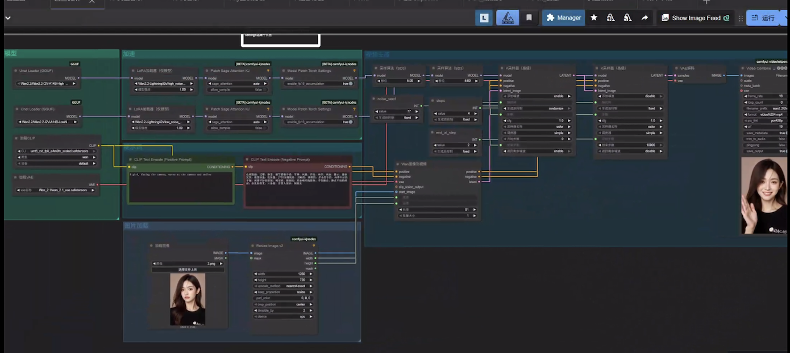

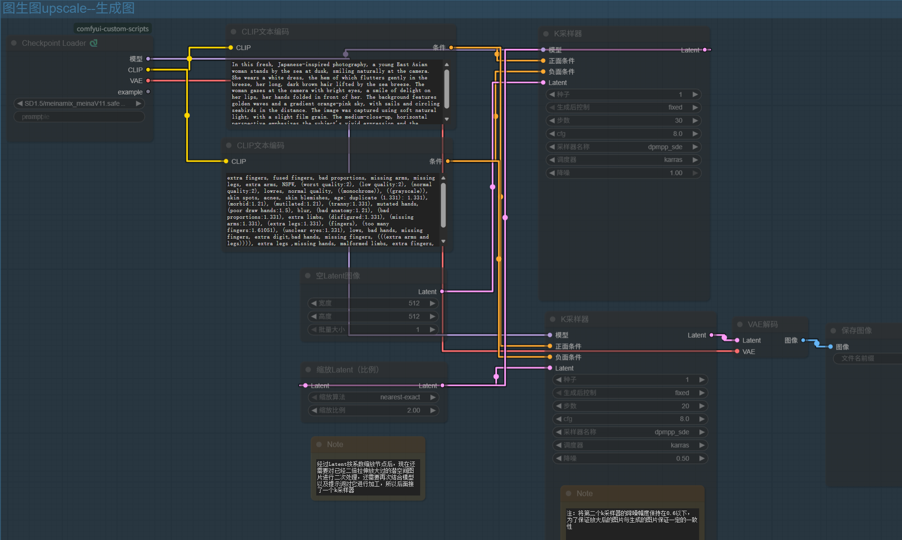

**五、文生音乐实战**

**【学习目标】**

• 理解文生音乐的基本原理（文本语义到音乐维度的映射）

• 了解 DiffRhythm 模型的核心能力与适用边界

• 能够在 ComfyUI 中完成文生音乐环境配置与基础工作流搭建

• 能利用插件和参数调整生成满足实际需求的背景音乐素材

文生音乐是 AIGC 多模态生成中的重要方向之一。与文生图通过文字生成图像类似，文生音乐是根据用户输入的文字描述，生成具有节奏、旋律、风格与情绪特征的音频内容。在 ComfyUI 生态中，借助相应的音乐生成节点和模型，以将“文本提示词—参数设置—音频输出”这一过程组织成可视化工作流，从完成背景音乐、氛围音乐或短音频片段的生成。

对于初学者而言，文生音乐不仅能帮助理解“文本到内容生成”的跨模态逻辑，也能进一步拓展 ComfyUI的应用边界，使学习者具备从图像、视频到音频的完整内容生产思维。

**5.1 文生音乐的基本原理**

文生音乐是 AIGC 多模态生成中的重要方向之一。与文生图通过文字生成图像类似，文生音乐是根据用户输入的文字描述，生成具有节奏、旋律、风格与情绪特征的音频内容。在 ComfyUI 生态中，借助相应的音乐生成节点和模型，以将“文本提示词—参数设置—音频输出”这一过程组织成可视化工作流，从完成背景音乐、氛围音乐或短音频片段的生成。

对于初学者而言，文生音乐不仅能帮助理解“文本到内容生成”的跨模态逻辑，也能进一步拓展 ComfyUI的应用边界，使学习者具备从图像、视频到音频的完整内容生产思维。

文生音乐的核心逻辑，是将自然语言中的语义信息映射为音乐中的若干关键维度，例如节奏、旋律、情绪、风格、乐器和速度等。也就是说，用户输入的文字并不会直接变成“歌词”，而是会被模型理解成一组音乐控制条件，再进一步生成对应的音频片段。

文生音乐的生成过程可以分为以下步骤：

步骤1——输入文本提示词：用户输入对音乐的描述，包括风格、情绪、乐器、节奏、场景等信息。

步骤2——模型进行语义解析：模型将文字描述转化为内部条件表示，用于约束后续音乐生成。

步骤3——生成音频特征或音频片段：模型根据条件生成一段具有对应特征的音频内容。

步骤4——音频解码与导出：将模型生成结果解码为可播放的音频文件，例如 .wav、.mp3 等格式。

文生音乐与文生图的相似点

都是“文本条件 → 内容生成”的过程；

都需要提示词控制生成方向；

都可以通过参数控制结果的风格与复杂度；

都适合通过 ComfyUI 工作流方式进行可视化搭建。

> 文生音乐与文生图的不同点

文生图关注的是画面构图、细节和风格；

文生音乐关注的是节奏、旋律、情绪和时间结构；

图像结果通常是一次性静态输出，而音乐天然带有时间维度；

音乐生成更强调“连贯性”和“听觉舒适度”。

> 因此，文生音乐不是简单地“让模型生成声音”，而是让模型根据文本描述创造
>
> 出一段具有可听性和场景适配性的音乐内容。

**5.2 DiffRhythm 原理与能力边界**

DiffRhythm 是一种面向音乐生成的模型思路，强调通过扩散式或条件式生成方式，根据文本描述输出具有节奏感和风格特征的音乐片段。在 ComfyUI 中，相关节点通常把音乐生成过程拆解为文本输入->参数控制->音频生成->结果输出几个模块，便于用户理解与调整。

• 擅长：生成具有明确风格和情绪的短音频（5-30秒），如背景音乐、氛围音效、节奏片段

• 局限：不适合生成复杂的完整歌曲（含歌词演唱）；对非常具体的音乐指令（如 B 小调、120BPM、3/4 拍）的支持有限

• 发展趋势：开源文生音乐模型正处于快速发展期，生成质量和时长都在持续提升中

**5.3文生音乐配置流程**

文生音乐在 ComfyUI 中通常通过自定义节点实现，常用的节点套件包括 Stable Audio（Stability AI 推出的音乐生成模型）和 DiffRhythm。配置步骤：

步骤1：在 ComfyUI Manager 中搜索并安装音乐生成相关自定义节点（如 ComfyUI-StableAudio 或 DiffRhythm 节点）。

步骤2：下载对应的音乐生成模型文件（如 stable-audio-open-1.0），放入 models 目录。

步骤3：在 ComfyUI 中加载音乐生成节点，连接文本提示词输入。

步骤4：设置生成参数（时长、风格强度等），运行生成。

步骤5：导出为 .wav 或 .mp3 音频文件。

**5.4 插件扩展与功能增强**

除了基础的文生音乐节点，还可以通过以下插件和方式扩展能力：

• Stable Audio：Stability AI 官方音乐生成模型，支持从文本描述生成高质量背景音乐和音效

• AudioLDM 系列：开源音频生成模型，支持文本到音频、音频修复等多种任务

• MMAudio：支持视频配音和音频生成的多模态模型，可与图生视频工作流联动

**5.5 文生音乐实操案例**

**【项目：为短视频生成背景音乐】**

项目目标：根据视频的主题和情绪，生成一段匹配的背景音乐（BGM）

输入素材：视频主题描述（如旅行 vlog、温馨日常、快节奏运动等），音乐情绪和风格偏好

关键节点与参数：

• 模型：Stable Audio Open 1.0 或 DiffRhythm

• 时长：15\~30 秒

• 提示词要点：情绪词 + 风格词 + 乐器 + 节奏

• 示例提示词：calm acoustic guitar, gentle piano, warm atmosphere, slow tempo, suitable for travel vlog

操作步骤：

在 ComfyUI 中加载文生音乐节点

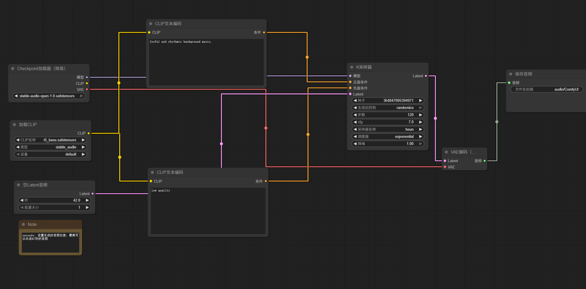

编写提示词：根据视频主题选择对应的情绪、风格和乐器描述

设置生成时长（如 20 秒），运行生成

试听生成的音频，评估是否与视频主题匹配

如需调整，修改提示词或参数后重新生成

导出为 .wav 文件

交付结果：一段 .wav 格式的背景音乐，时长 15-30 秒，情绪和风格与视频主题匹配

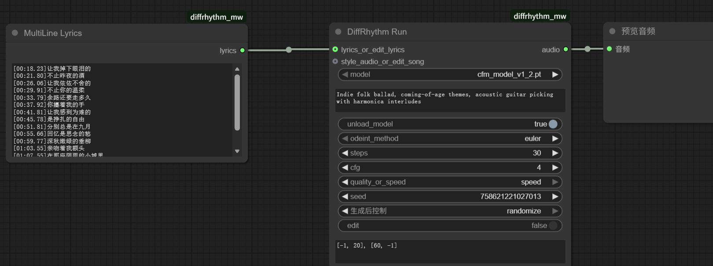

**【本章小结】**

本章介绍了文生音乐的基本原理与 ComfyUI 中的实现方案。文生音乐与文生图共享文本条件->内容生成的核心逻辑，但关注的是节奏、旋律、情绪等音乐维度。学员应理解 DiffRhythm 等模型的能力边界，并能完成基础的文生音乐环境配置与生成实操。
