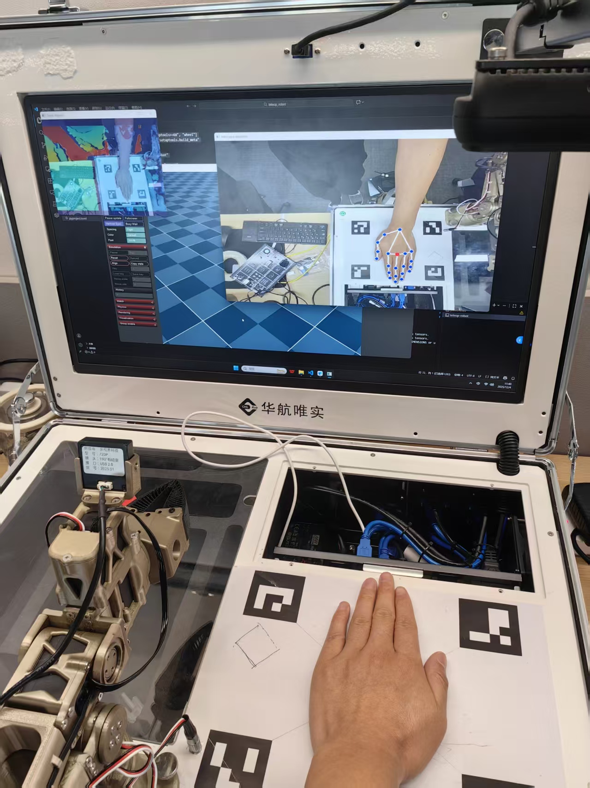

# AI02pro手势控操实验指导书

**AI02pro手势控操实验指导书**

1\. **环境安装**

| 
Shell conda create -n teleop_robot python=3.12 conda activate teleop_robot conda install pinocchiopip install -e . cd libs\pyorbbecsdk pip install pyorbbecsdk-2.0.15-cp312-cp312-win_amd64.whl
 |
| --------------------------------------------------------------------------------------------------------------------------------------------------------------------------------------------------------------------- |

2\. **项目代码**

| 
Shell |- teleop_robot |- configs # 配置文件 |- libs # 三方库 |- models # 机械臂URDF模型 |- src # 源码目录 |- teleop_robot |- kinematics # 运动学 |- robots # 机械臂控制 |- simulation # 仿真 |- teleoperators # 遥操作控制器
 |
| --------------------------------------------------------------------------------------------------------------------------------------------------------------------------------------------------------------------------------- |

3\. **键盘控制**

按键：

|        |        |
| ------ | ------ |
| **按键** | **功能** |
| 上方向键   | 向前移动   |
| 下方向键   | 向后移动   |
| 左方向键   | 向左移动   |
| 右方向键   | 向右移动   |
| z      | 下降     |
| x      | 升高     |
| r      | 打开夹爪   |
| t      | 关闭夹爪   |
| q      | 末端向左旋转 |
| e      | 末端向右旋转 |
| w      | 抬头     |
| s      | 低头     |
| a      | 左偏     |
| d      | 右偏     |

启动命令：

| 
Shell teleop-robot.exe --config_path=configs/keyboard_sam01.yaml
 |
| -------------------------------------------------------------------------- |

详细参数：

| 
YAML # 控制器参数 controller: type: keyboard # 控制器类型：gamepad(手柄)，keyboard(键盘)，handpose(手势) step_sizes: # 步幅 x: 0.001 y: 0.001 z: 0.001 roll: 0.01 # 旋转角步幅 pitch: 0.01 # 俯仰角步幅 yaw: 0.01 # 偏航角步幅 gripper: 0.01 # 夹爪步幅 viewer: scene_path: C:/ai02pro/project/teleop_robot/models/sam01_robot_left/urdf/scene.xml distance: 1.5 # 摄像机高度 azimuth: 150 # 摄像机方位角 elevation: -20 # 摄像机仰角 # 运动学参数 kinematics: urdf_path: C:/ai02pro/project/teleop_robot/models/sam01_robot_left/urdf/sam01_robot.xml target_frame_name: joint6 position_weight: 20.0 rotation_weight: 1 last_joint_as_gripper: false last_joint_name: joint7 # 机械臂参数 # robot: # type: sam01 # 机械臂类型 # port: robot # COM口 # calibration_path: C:/ai02pro/user_data/test/lerobot/calibration/robot_arm_follower.json # 校准文件路径 # reverse_gripper: true # 夹爪关节逆变换 # 全局参数 init_joints: [0, 1.55, -1.55, 0, 0, 0, 0.0] # 初始关节角 position_low_bound: [-0.8, -0.8, 0] # 末端位置下限 position_up_bound: [0.8, 0.8, 0.8] # 末端位置上限 roll_joint_index: 5 # roll角对应关节索引 pitch_joint_index: 3 # pitch角对应关节索引 yaw_joint_index: 4 # yaw角对应关节索引 gripper_limit: [0, 1.6] # 夹爪关节范围
 |
| -------------------------------------------------------------------------------------------------------------------------------------------------------------------------------------------------------------------------------------------------------------------------------------------------------------------------------------------------------------------------------------------------------------------------------------------------------------------------------------------------------------------------------------------------------------------------------------------------------------------------------------------------------------------------------------------------------------------------------------------------------------------------------------------------------------------------------------------------------------------------------------------------------------------------------------------------------------------------------------------------------------------------------------------------------------------------------------------------------------------------------------------------------------------------------------------------------------------------------------- |

注意：建议将上述参数的robot相关参数先注释掉，即先不控制机械臂实体，在仿真中调试到最佳状态后再将注释打开，控制机械臂。

4\. **手柄控制**

使用罗技标准手柄，**使用前请确认手柄控制模式为D（Direct），MODE指示灯为熄灭状态**

|                                                                                   |                                                                                   |
| :-------------------------------------------------------------------------------: | :-------------------------------------------------------------------------------: |
| .png>) | .png>) |

按键：

|        |                |
| ------ | -------------- |
| **按键** | **功能**         |
| 左摇杆    | 上下左右分别控制前后左右移动 |
| 右摇杆    | 上下分别控制升高和降低    |
| 上方向键   | 抬头             |
| 下方向键   | 低头             |
| 左方向键   | 左偏             |
| 有方向键   | 右偏             |
| LB     | 末端向左旋转         |
| RB     | 末端向右旋转         |
| LT     | 打开夹爪           |
| RT     | 关闭夹爪           |

启动命令：

| 
Shell teleop-robot.exe --config_path=configs/gamepad_sam01.yaml
 |
| ------------------------------------------------------------------------- |

详细参数：

| 
YAML # 控制器参数 controller: type: gamepad # 控制器类型：gamepad(手柄)，keyboard(键盘)，handpose(手势) step_sizes: x: 0.001 y: 0.001 z: 0.001 roll: 0.01 # 旋转角步幅 pitch: 0.01 # 俯仰角步幅 yaw: 0.01 # 偏航角步幅 gripper: 0.01 # 夹爪步幅 # 仿真可视化器参数 viewer: scene_path: C:/ai02pro/project/teleop_robot/models/sam01_robot_left/urdf/scene.xml # 场景文件路径 distance: 1.5 # 摄像机高度 azimuth: 150 # 摄像机方位角 elevation: -20 # 摄像机仰角 # 运动学参数 kinematics: urdf_path: C:/ai02pro/project/teleop_robot/models/sam01_robot_left/urdf/sam01_robot.xml # URDF路径 target_frame_name: joint6 # 末端关节 position_weight: 20.0 # 逆解位置权重 rotation_weight: 1 # 逆解旋转权重 last_joint_as_gripper: True # 最后一个关节作为夹爪 last_joint_name: joint7 # 最后一个关节名称 # 机械臂参数 robot: type: sam01 # 机械臂类型 port: robot # COM口 calibration_path: C:/ai02pro/user_data/test/lerobot/calibration/robot_arm_follower.json # 校准文件路径 reverse_gripper: true # 夹爪关节逆变换 init_joints: [0, 1.55, -1.55, 0, 0, 0, 0.0] # 初始关节角 position_low_bound: [-0.8, -0.8, 0] # 末端位置下限 position_up_bound: [0.8, 0.8, 0.8] # 末端位置上限 roll_joint_index: 5 # roll角对应关节索引 pitch_joint_index: 3 # pitch角对应关节索引 yaw_joint_index: 4 # yaw角对应关节索引 gripper_limit: [0, 1.6] # 夹爪关节范围
 |
| -------------------------------------------------------------------------------------------------------------------------------------------------------------------------------------------------------------------------------------------------------------------------------------------------------------------------------------------------------------------------------------------------------------------------------------------------------------------------------------------------------------------------------------------------------------------------------------------------------------------------------------------------------------------------------------------------------------------------------------------------------------------------------------------------------------------------------------------------------------------------------------------------------------------------------------------------------------------------------------------------------------------------------------------------------------------------------------------------------------------------------------------------------------------------------------------------------------------------------------------------------------------------------------------- |

注意：建议将上述参数的robot相关参数先注释掉，即先不控制机械臂实体，在仿真中调试到最佳状态后再将注释打开，控制机械臂。

5\. **手势控制**

手势控制需搭配3D相机使用。相机的角度可以有几种配置：垂直向下、水平向前、水平向右。

.png>)

启动命令：

| 
Shell teleop-robot.exe --config_path=configs/handpose_sam01.yaml
 |
| -------------------------------------------------------------------------- |

详细参数：

| 
YAML # 控制器参数 controller: type: hand_pose camera_type: orbbec # 相机类型：orbbrec，opencv rotate_image: false # 是否旋转图像90度 target_hand: left # 目标手掌，left或right scale_factors: # 手部移动的缩放因子 x: 0.7 y: 0.7 z: 0.3 gripper: 0.1 cam_pos_convert_map: # 相机位置转换为机械臂位置的轴映射关系 x: y y: x z: -z # 仿真可视化器参数 viewer: scene_path: C:/ai02pro/project/teleop_robot/models/sam01_robot_left/urdf/scene.xml # 场景文件路径 distance: 1.5 # 摄像机高度 azimuth: 150 # 摄像机方位角 elevation: -20 # 摄像机仰角 # 运动学参数 kinematics: urdf_path: C:/ai02pro/project/teleop_robot/models/sam01_robot_left/urdf/sam01_robot.xml target_frame_name: joint6 position_weight: 20.0 rotation_weight: 1 last_joint_as_gripper: true last_joint_name: joint7 # 机械臂参数 # robot: # type: sam01 # 机械臂类型 # port: robot # COM口 # calibration_path: C:/ai02pro/user_data/test/lerobot/calibration/robot_arm_follower.json # 校准文件路径 # reverse_gripper: true # 夹爪关节逆变换 init_joints: [0, 1.55, -1.55, 0, 0, 0, 0.0] # 初始关节角 position_low_bound: [-0.8, -0.8, 0] # 末端位置下限 position_up_bound: [0.8, 0.8, 0.8] # 末端位置上限 max_ee_step_m: 0.1 # 末端最大步幅
 |
| -------------------------------------------------------------------------------------------------------------------------------------------------------------------------------------------------------------------------------------------------------------------------------------------------------------------------------------------------------------------------------------------------------------------------------------------------------------------------------------------------------------------------------------------------------------------------------------------------------------------------------------------------------------------------------------------------------------------------------------------------------------------------------------------------------------------------------------------------------------------------------------------------------------------------------------------------------------------------------------------------------------------------------------------------------------------------------------------------------------------------------------------------------------------------------------------------------- |

注意：建议将上述参数的robot相关参数先注释掉，即先不控制机械臂实体，在仿真中调试到最佳状态后再将注释打开，控制机械臂。

目前手势控制只能控制xyz位置，无法控制旋转角度。因此初始化时需要将机械臂先调整到合适状态，如上图所示。

程序启动后，需要先初始化手部位置，使得手处于摄像头画面中间位置，如下图所示：

确定好位置后，按下回车键，画面中将出现一个红点，该红点即为手部的初始位置。之后缓慢、平稳移动手掌，将看到仿真中机械臂同步运动。如果观测到机械臂运动方向与手掌不同，则需要调整参数：

| 
Shell cam_pos_convert_map： x: y y: x z: -z
 |
| ------------------------------------------------------------- |

如果需要结束控制，则将手掌变为握拳状态，程序识别到该姿态后即可退出。

整体控制效果演示：

**> 附：视频文件「微信视频2025-12-04\_114800\_488.mp4」，请在 GitBook 中手动上传该文件。**
