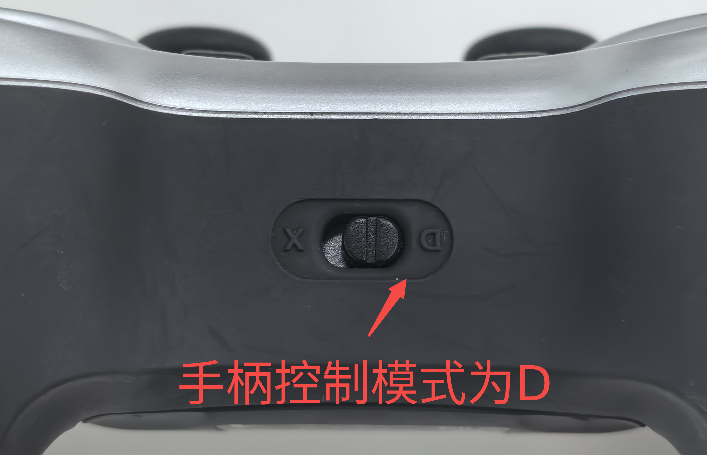
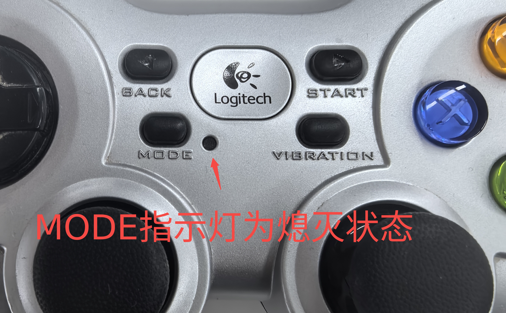

**AI02pro模仿学习实验指导书**

1\. **环境安装**

<table>
<colgroup>
<col style="width: 100%" />
</colgroup>
<tbody>
<tr>
<td style="text-align: left;">Shell 
# python3.12环境 
conda install pinocchio 
pip install torch==2.7.1 torchvision==0.22.1 --index-url https://download.pytorch.org/whl/cu128 
pip install -e ".[feetech,gamepad,kinematics]" 
cd libs 
pip install pyorbbecsdk-2.0.15-cp312-cp312-win_amd64.whl</td>
</tr>
</tbody>
</table>

2\. **项目代码**

<table>
<colgroup>
<col style="width: 100%" />
</colgroup>
<tbody>
<tr>
<td style="text-align: left;">Shell 
|- lerobot 
|- configs # 程序运行配置文件目录 
|- src # 源码目录 
|- lerobot 
|- libs # 工具包，如usb管理工具</td>
</tr>
</tbody>
</table>

3\. **机械臂校准**

目的：通过机械臂校准，可以将机械臂舵机角度标准化到固定空间，便于不同机械臂间的操作同步和模型同步。

**3.1 USB绑定**

目的：通过USB绑定，可以避免插拔USB导致端口变化而频繁修改配置参数。

操作方式：管理员运行打开libs/usbdeview/USBDeview.exe

**> 附：视频文件「20251202_184743.mp4」，请在 GitBook 中手动上传该文件。**

根据上述方法依次对机械臂和摄像头进行端口绑定，其中机械臂端口命名为robot，机械臂手肘部摄像头命令为wrist。

**3.2 校准**

<table>
<colgroup>
<col style="width: 100%" />
</colgroup>
<tbody>
<tr>
<td style="text-align: left;">Shell 
# 修改calibrate.yaml参数后运行 
lerobot-calibrate.exe --config_path=configs/calibrate.yaml</td>
</tr>
</tbody>
</table>

详细参数：

<table>
<colgroup>
<col style="width: 100%" />
</colgroup>
<tbody>
<tr>
<td style="text-align: left;">YAML 
robot: 
type: sam01_follower # 机械臂类型，无需修改 
id: robot_arm_follower # 机械臂ID, 可修改，与校准文件名称相关 
port: robot # 左侧从臂COM口名称 
cameras: {} # 摄像头参数，为空表示校准时不考虑摄像头 
calibration_dir: C:/ai02pro/user_data/test/lerobot_calibration # 校准文件目录</td>
</tr>
</tbody>
</table>

校准参考示例：（补充视频）

4\. **遥操作**

目前提供键盘和手柄两种遥操作方式。

键盘控制按键：

|          |              |
|:---------|:-------------|
| **按键** | **功能**     |
| w        | 向前移动     |
| s        | 向后移动     |
| a        | 向左移动     |
| d        | 向右移动     |
| q        | 升高         |
| e        | 降低         |
| r        | 打开夹爪     |
| f        | 关闭夹爪     |
| y        | 末端向左旋转 |
| u        | 末端向右旋转 |
| h        | 抬头         |
| j        | 低头         |
| n        | 左偏         |
| m        | 右偏         |

手柄控制按键：使用 罗技标准手柄，**使用前请确认手柄控制模式为D（Direct），MODE指示灯为熄灭状态**

|  |  |
|:--:|:--:|
|  |  |

|          |                              |
|:---------|:-----------------------------|
| **按键** | **功能**                     |
| 左摇杆   | 上下左右分别控制前后左右移动 |
| 右摇杆   | 上下分别控制升高和降低       |
| 上方向键 | 抬头                         |
| 下方向键 | 低头                         |
| 左方向键 | 左偏                         |
| 有方向键 | 右偏                         |
| LB       | 末端向左旋转                 |
| RB       | 末端向右旋转                 |
| LT       | 打开夹爪                     |
| RT       | 关闭夹爪                     |

遥操作前需要确定机械臂的运动空间，避免碰撞，运行如下命令：

<table>
<colgroup>
<col style="width: 100%" />
</colgroup>
<tbody>
<tr>
<td style="text-align: left;">Shell 
lerobot-find-joint-limits.exe --config_path=configs/find_joint_limits.yaml</td>
</tr>
</tbody>
</table>

启动后，拖动机械臂在设定的空间内移动，移动完成后按下ESC停止程序，将打印如下内容：

<table>
<colgroup>
<col style="width: 100%" />
</colgroup>
<tbody>
<tr>
<td style="text-align: left;">Shell 
Max ee position [0.3154, 0.147, 0.4375] 
Min ee position [-0.0376, -0.2263, 0.0525] 
Max joint pos position [59.8535, 98.2497, 59.9807, 6.0078, 7.4555, 68.4005, 93.6438] 
Min joint pos position [-45.4945, -59.4657, -98.2642, -88.1783, -20.9235, -4.6642, 92.8307]</td>
</tr>
</tbody>
</table>

将上述最大和最小的ee position（末端位姿）替换teleoperate.yaml中的默认参数：

<table>
<colgroup>
<col style="width: 100%" />
</colgroup>
<tbody>
<tr>
<td style="text-align: left;">YAML 
# 末端控制边界保护 
- name: ee_bounds_and_safety 
end_effector_bounds: # 位置边界 
min: [0, -0.23, 0.03] 
max: [0.25, 0.1, 0.15] 
max_ee_step_m: 0.2 # 单次移动最大距离，米</td>
</tr>
</tbody>
</table>

遥操作运行命令：

<table>
<colgroup>
<col style="width: 100%" />
</colgroup>
<tbody>
<tr>
<td style="text-align: left;">Shell 
lerobot-teleoperate.exe --config_path=configs/teleoperate.yaml</td>
</tr>
</tbody>
</table>

详细参数：

<table>
<colgroup>
<col style="width: 100%" />
</colgroup>
<tbody>
<tr>
<td style="text-align: left;">YAML 
robot: 
type: sam01_follower 
id: robot_arm_follower 
port: robot 
calibration_dir: C:/ai02pro/user_data/test/lerobot_calibration # 校准文件目录 
cameras: 
high: 
type: orbbec 
width: 640 
height: 480 
fps: 30 
# wrist: 
# type: opencv 
# index_or_path: wrist 
# width: 640 
# height: 480 
# fps: 30 
teleop: 
type: gamepad # 遥操作方式：手柄(gamepad)、键盘（keyboard_ee） 
use_gripper: true 
 
processor: 
robot_action_steps: 
# delta移动坐标转换成机械臂控制指令 
- name: map_delta_action_to_robot_action 
 
# 转换成末端控制 
- name: ee_reference_and_delta 
kinematics_config: &amp;kc 
urdf_path: C:/ai02pro/project/lerobot/assets/sam01_robot_left/sam01_robot.xml # URDF文件路径，xml或URDF 
target_frame_name: joint6 # 末端关节名称 
last_joint_as_gripper: true # 最后一个关节是否时夹爪 
last_joint_name: joint7 # 最后一个关节是否为夹爪，last_joint_as_gripper为真时设置 
position_weight: 20.0 # 逆解位置权重 
rotation_weight: 1 # 逆解旋转权重 
end_effector_step_sizes: # 末端步幅 
x: 0.002 
y: 0.002 
z: 0.002 
roll: 1 # 旋转 
pitch: 1 # 俯仰角 
yaw: 1 # 偏航角 
motor_names: &amp;mn ["shoulder_pan","shoulder_lift","elbow_flex","wrist_flex","forearm_roll","wrist_roll","gripper"] 
use_latched_reference: true 
rpy_joint_index_map: 
roll: 5 
pitch: 3 
yaw: 4 
 
# 末端控制边界保护 
- name: ee_bounds_and_safety 
end_effector_bounds: # 位置边界 
min: [0, -0.23, 0.03] 
max: [0.25, 0.1, 0.15] 
max_ee_step_m: 0.2 # 单次移动最大距离，米 
 
# 夹爪速度转化成角度 
- name: gripper_velocity_to_joint 
clip_max: 100 # 最大值 
clip_min: 0 # 最小值 
speed_factor: 1.0 # 速度系数 
discrete_gripper: true # 是否离散化到[-1, 0, 1] 
 
# 末端控制转换关节角度 
- name: inverse_kinematics_ee_to_joints 
kinematics_config: *kc 
motor_names: *mn 
initial_guess_current_joints: true # 使用当前关节角作为初始值 
 
display_data: true</td>
</tr>
</tbody>
</table>

5\. **数据采集**

运行命令：

<table>
<colgroup>
<col style="width: 100%" />
</colgroup>
<tbody>
<tr>
<td style="text-align: left;">Shell 
lerobot-record.exe --config_path=configs/record_dataset.yaml</td>
</tr>
</tbody>
</table>

详细参数：

<table>
<colgroup>
<col style="width: 100%" />
</colgroup>
<tbody>
<tr>
<td style="text-align: left;">YAML 
robot: 
type: sam01_follower 
id: robot_arm_follower 
port: robot 
calibration_dir: C:/ai02pro/user_data/test/lerobot_calibration # 校准文件目录 
cameras: 
high: 
type: orbbec 
width: 640 
height: 480 
fps: 30 
# wrist: 
# type: opencv 
# index_or_path: wrist 
# width: 640 
# height: 480 
# fps: 30 
teleop: 
type: gamepad 
use_gripper: true 
 
processor: 
# 遥操作指令处理步骤 
teleop_action_steps: 
# delta移动坐标转换成机械臂控制指令 
- name: map_delta_action_to_robot_action 
 
# 转换成末端控制 
- name: ee_reference_and_delta 
kinematics_config: &amp;kc # 运动学参数 
urdf_path: C:/ai02pro/project/lerobot/assets/sam01_robot_left/sam01_robot.xml # URDF文件路径，xml或URDF 
target_frame_name: joint6 # 末端关节名称 
last_joint_as_gripper: true # 最后一个关节是否时夹爪 
last_joint_name: joint7 # 最后一个关节是否为夹爪，last_joint_as_gripper为真时设置 
position_weight: 20.0 # 逆解位置权重 
rotation_weight: 1 # 逆解旋转权重 
end_effector_step_sizes: # 末端步幅 
x: 0.002 
y: 0.002 
z: 0.002 
roll: 1 # 旋转 
pitch: 1 # 俯仰角 
yaw: 1 # 偏航角 
motor_names: &amp;mn ["shoulder_pan","shoulder_lift","elbow_flex","wrist_flex","forearm_roll","wrist_roll","gripper"] 
rpy_joint_index_map: # RPY角度与关节映射 
roll: 5 # 映射到第6个关节 
pitch: 3 # 映射到第4个关节 
yaw: 4 # 映射到第5个关节 
 
# 末端控制边界保护 
- name: ee_bounds_and_safety 
end_effector_bounds: # 位置边界 
min: [0, -0.23, 0.03] 
max: [0.25, 0.1, 0.15] 
max_ee_step_m: 0.2 # 单次移动最大距离，米 
 
# 夹爪速度转成角度 
- name: gripper_velocity_to_joint 
clip_max: 100 # 最大值 
clip_min: 0 # 最小值 
speed_factor: 1.0 # 速度系数 
discrete_gripper: true # 是否离散化到[-1, 0, 1] 
 
# 机械臂指令处理步骤 
robot_action_steps: 
# 末端控制转换关节角度 
- name: inverse_kinematics_ee_to_joints 
kinematics_config: *kc 
motor_names: *mn 
initial_guess_current_joints: true # 使用当前关节角作为初始值 
 
# 机械臂观测处理步骤 
robot_observation_steps: 
# 机械臂关节角转换为EE末端 
- name: forward_kinematics_joints_to_ee 
kinematics_config: *kc 
motor_names: *mn 
 
dataset: 
root: C:/ai02pro/user_data/test/lerobot_datasets # 数据集根目录 
repo_id: test/fenjian_test_1 # 数据集名称 
single_task: 桌面分拣 # 数据集描述 
fps: 30 # 帧率 
episode_time_s: 60 # 视频最大时长 
reset_time_s: 10 # 重置时间 
num_episodes: 10 # 数据集数量 
tags: ["sam","tutorial"] # 标签 
push_to_hub: false # 是否推送到huggingface 
 
display_data: true # 是否显示数据 
resume: false # 是否继续录制</td>
</tr>
</tbody>
</table>

6\. **数据回放**

完成数据采集后，可以回放机械臂的轨迹路径。

运行命令：

<table>
<colgroup>
<col style="width: 100%" />
</colgroup>
<tbody>
<tr>
<td style="text-align: left;">Shell 
lerobot-replay.exe --config_path=configs/replay.yaml</td>
</tr>
</tbody>
</table>

7\. **数据集可视化**

运行命令：

<table>
<colgroup>
<col style="width: 100%" />
</colgroup>
<tbody>
<tr>
<td style="text-align: left;">Shell 
lerobot-replay.exe --config_path=configs/replay.yaml</td>
</tr>
</tbody>
</table>

详细参数：

<table>
<colgroup>
<col style="width: 100%" />
</colgroup>
<tbody>
<tr>
<td style="text-align: left;">Shell 
repo_id: test/fenjian_test_1 
root: C:/ai02pro/user_data/test/lerobot_datasets</td>
</tr>
</tbody>
</table>

结果示例：（补充图片）

8\. **模型训练**

运行命令：

<table>
<colgroup>
<col style="width: 100%" />
</colgroup>
<tbody>
<tr>
<td style="text-align: left;">Shell 
lerobot-train.exe --config_path=configs/train_act.yaml</td>
</tr>
</tbody>
</table>

详细参数：

<table>
<colgroup>
<col style="width: 100%" />
</colgroup>
<tbody>
<tr>
<td style="text-align: left;">YAML 
dataset: 
repo_id: test/fenjian_test_1 
root: C:/ai02pro/user_data/test/lerobot_datasets 
image_transforms: 
enable: false # 是否开启图像增强 
# episodes: [0,1,2,3,4,5,6,7,8,9,10,11,12,13,14,15,16,17,18,19] # 训练的视频索引序列 
 
policy: 
type: act # 策略类型 
vision_backbone: resnet18 # 视觉骨干网络名称 
pretrained_backbone_weights: ResNet18_Weights.IMAGENET1K_V1 # 预训练权重名称 
backbone_per_camera: false # 是否每个摄像头使用不同骨干网络 
chunk_size: 100 # 行为块大小 
kl_weight: 50.0 # KL散度损失权重系数 
optimizer_lr: 1e-5 # 学习率 
optimizer_lr_backbone: 1e-5 # 骨干网络学习率 
optimizer_weight_decay: 1e-4 # 权重衰减 
use_amp: true # 是否使用混合精度训练 
push_to_hub: false # 是否推送到huggingface 
use_vae: true # 是否使用VAE编码器 
 
output_dir: C:/ai02pro/user_data/test/lerobot_trained_models/act_fenjian_test1 # 输出文件夹 
job_name: act_fenjian_test1 # 任务名称 
batch_size: 8 # 批次大小 
steps: 30000 # 总步数 
save_freq: 10000 # 保存间隔 
num_workers: 6 # 数据加载线程数</td>
</tr>
</tbody>
</table>

9\. **模型测试**

运行命令：

<table>
<colgroup>
<col style="width: 100%" />
</colgroup>
<tbody>
<tr>
<td style="text-align: left;">Shell 
lerobot-test.exe --config_path=configs/test_policy.yaml</td>
</tr>
</tbody>
</table>

详细参数：

<table>
<colgroup>
<col style="width: 100%" />
</colgroup>
<tbody>
<tr>
<td style="text-align: left;">YAML 
robot: 
type: sam01_follower 
id: robot_arm_follower 
port: robot 
calibration_dir: C:/ai02pro/user_data/test/lerobot_calibration # 校准文件目录 
cameras: 
high: 
type: orbbec 
width: 640 
height: 480 
fps: 30 
# wrist: 
# type: opencv 
# index_or_path: wrist 
# width: 640 
# height: 480 
# fps: 30 
policy: 
type: act # 策略类型 
n_action_steps: 100 # act参数，单次预测执行的步数 
device: cuda 
 
processor: 
# 机械臂指令处理步骤 
robot_action_steps: 
# 末端控制转换关节角度 
- name: inverse_kinematics_ee_to_joints 
kinematics_config: &amp;kc 
urdf_path: C:/ai02pro/project/lerobot/assets/sam01_robot_left/sam01_robot.xml 
target_frame_name: joint6 
last_joint_as_gripper: true 
last_joint_name: joint7 
position_weight: 20.0 
rotation_weight: 1 
motor_names: &amp;mn ["shoulder_pan","shoulder_lift","elbow_flex","wrist_flex","forearm_roll","wrist_roll","gripper"] 
initial_guess_current_joints: true 
 
# 机械臂观测处理步骤 
robot_observation_steps: 
# 机械臂关节角转换为EE末端 
- name: forward_kinematics_joints_to_ee 
kinematics_config: *kc 
motor_names: *mn 
 
task: # 任务描述 
inference_time_s: 300 # 推理时长 
fps: 30 # 帧率 
pretrained_name_or_path: C:/ai02pro/user_data/test/lerobot_trained_models/act_fenjian_test1/checkpoints/last/pretrained_model</td>
</tr>
</tbody>
</table>
