**AI02pro知识库实验指导书**

本实验介绍 AI02Pro 中的知识库启动、搭建和使用全流程，使用 RAGFlow 创建和管理知识库，并通过 Dify 调用知识库、编排智能体工作流。完成知识库问答后，可进一步连接语音模块和 MCP 工具，实现“语音输入—意图理解—知识检索或工具调用—语音反馈”的完整交互流程。

工作流主要流使用程如下：

用户输入问题 → Dify 工作流分析问题 → RAGFlow 检索相关资料 → 大语言模型生成回答 → 文字或语音输出结果

当工作流调用 MCP 工具时流程如下：

用户输入指令 → 大语言模型理解意图 → 调用 MCP 工具 → 工具执行任务 → 返回执行结果

**1.启动知识库**

打开docker desktop

点击左侧containers，在点击右侧dify_docker中的启动按钮，等待容器状态变为 **Running**。

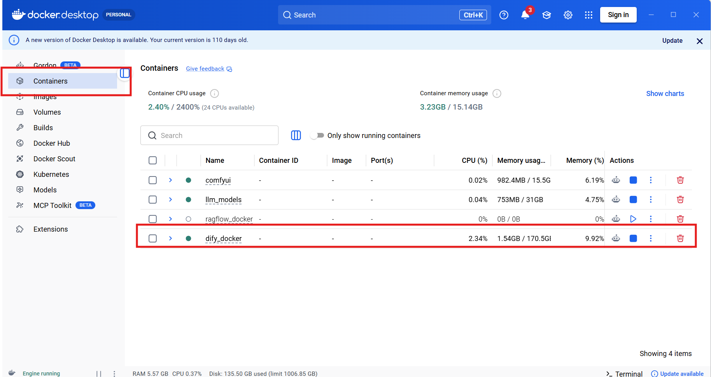

**2.搭建智能体工作流**

智能体工作流处理流程如下：用户输入问题 → Dify 工作流分析问题 → RAGFlow 检索相关资料 → 大语言模型生成回答 → 文字或语音输出结果。

当工作流调用 MCP 工具时，处理流程如下：用户输入指令 → 大语言模型理解意图 → 调用 MCP 工具 → 工具执行任务 → 返回执行结果。

**2.1RagFlow创建知识库**

进入ragflow的知识库页面，点击创建知识库。

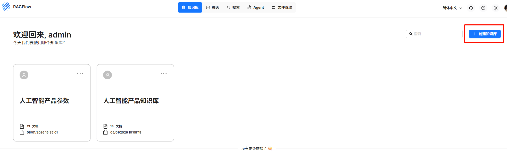

按需填写知识库名称，进入知识库配置页面。

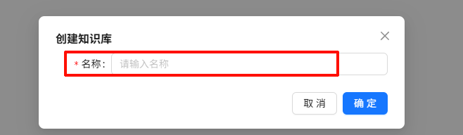

基本无需更改，鼠标下滑点击保存即可。

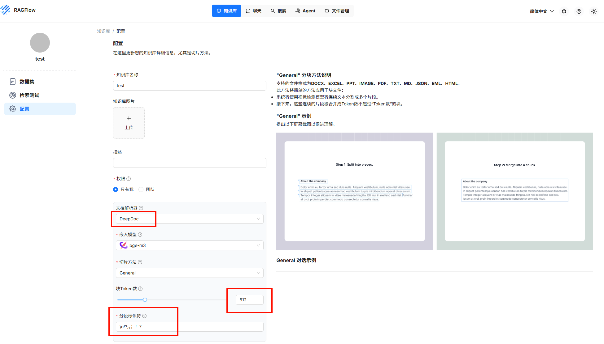

保存后即可开始新增文件，选择本地文件。

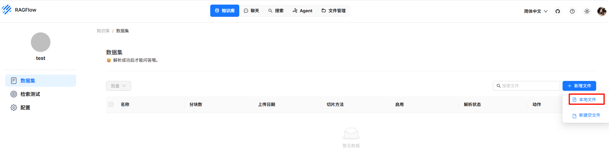

即可按需选择相关文件。

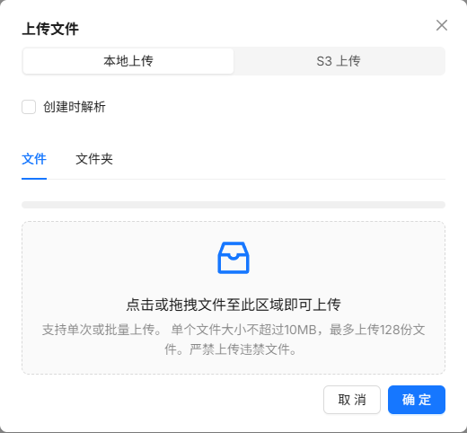

导入成功后，进行解析，稍等片刻即可解析成功。

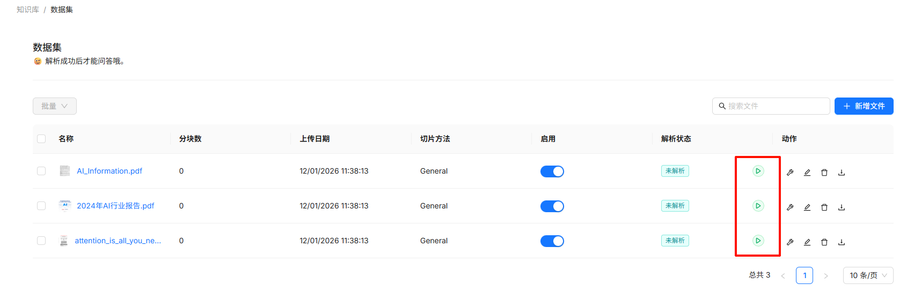

解析成功后即可进行检索测试

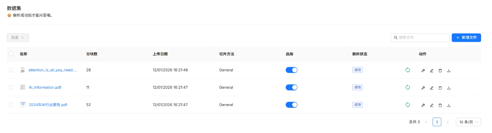

打开知识库的检索测试页面。

输入一个能够在上传资料中找到答案的问题。

执行测试并查看召回内容。确认返回内容与原始资料相关，并且引用片段能够支持问题答案。

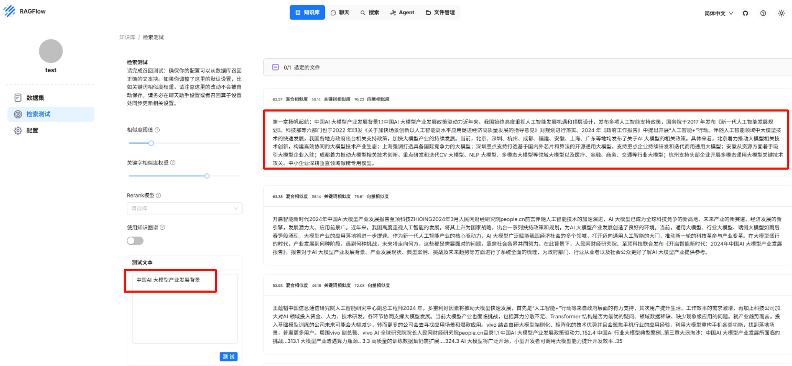

**2.2RAGFlow 知识库接入 Dify**

默认登录admin@chlrob.com账号密码123456qaz。

以人工智能产品参数知识库为例

|  |  |
|:---|:--:|
| 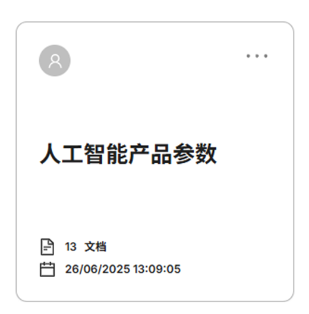 | 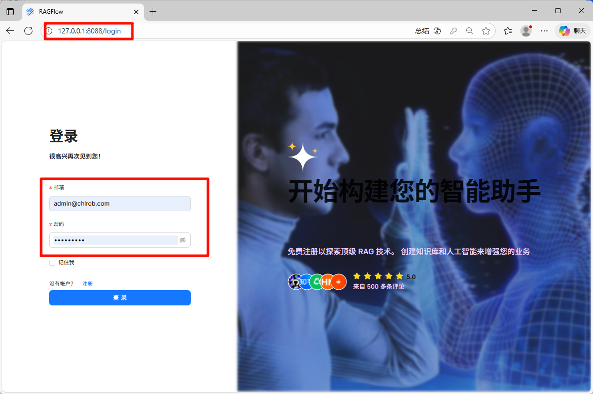 |

**2.2.1获取 RAGFlow API Key**

进入RAGFlow，点击右上角头像--\>API--\>API KEY

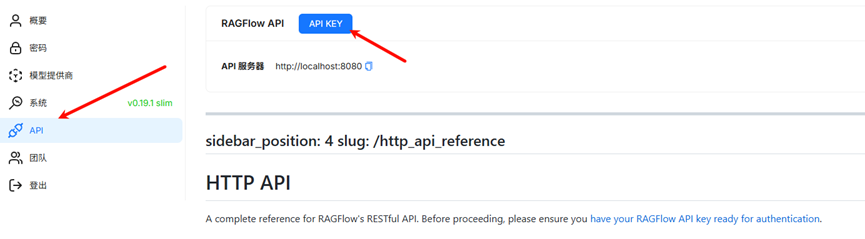

密钥格式如下：ragflow-\*\*\*\*\*

登录dify，点击知识库--\>外部知识库API

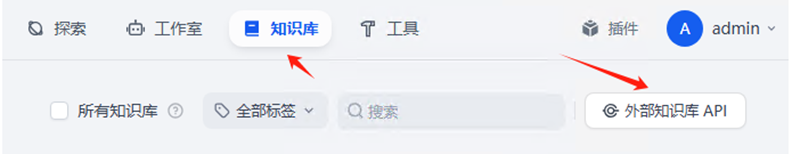

**2.2.2 添加外部知识库API**

进入 **知识库 → 外部知识库 API**。

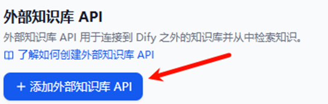

编辑外部知识库API，填写以下参数：

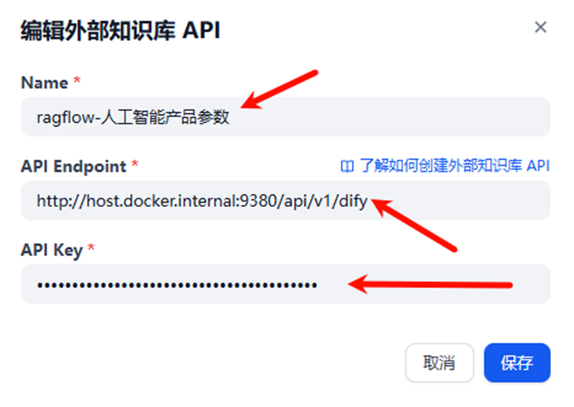

<table>
<colgroup>
<col style="width: 100%" />
</colgroup>
<tbody>
<tr>
<td style="text-align: left;">
参数说明：

Name名称可以随便写，没有要求

API Endpoint的格式为：RAGFlow访问地址+/api/v1/dify (通常为：http://host.docker.internal:9380/api/v1/dify)

API Key：RAGFlow的api key
</td>
</tr>
</tbody>
</table>

**2.2.3 连接外部知识库**

打开RAGFlow的知识库

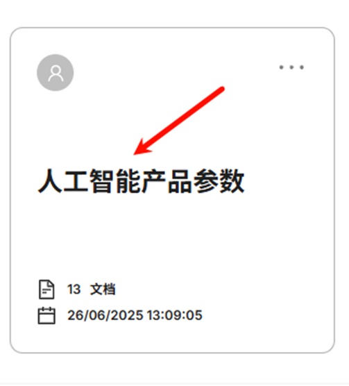

找到网页导航栏的url后面的id，就是知识库的id

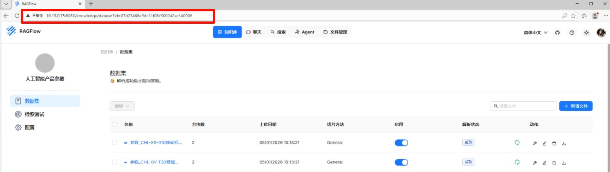

登录到dify，创建知识库--\>连接外部知识库

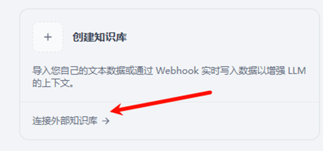

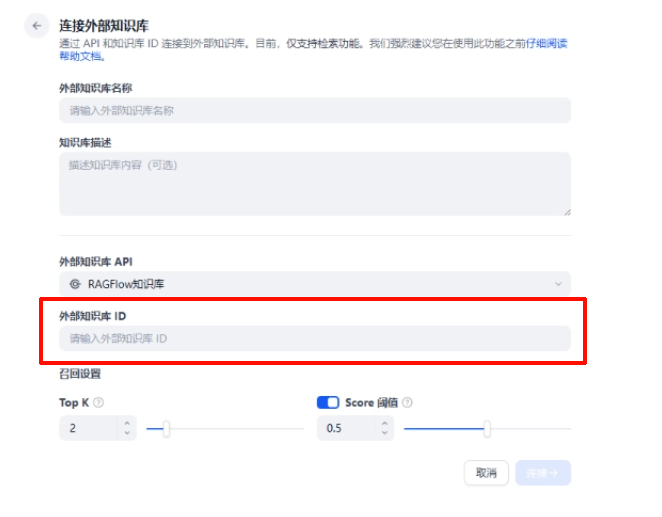

填写以下配置：

<table>
<colgroup>
<col style="width: 100%" />
</colgroup>
<tbody>
<tr>
<td style="text-align: left;">
外部知识库名称，可以随便写

外部知识库api，选择ragflow-人工智能产品参数

外部知识库id，就是RAGFlow对应的知识库id

Top_k设置为2，可以调大一些

Score设置为0.5

进行召回测试，即可发挥召回结果
</td>
</tr>
</tbody>
</table>

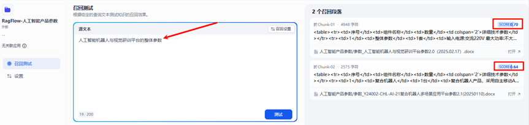

**2.3Dify搭建工作流**

**2.3.1 选择应用类型**

Dify 常用的流程应用包括 Workflow 和 Chatflow：

**Workflow**：适合一次性任务、自动化处理和批量任务，例如内容生成、数据处理和报告生成。

**Chatflow**：适合需要保留上下文的多轮对话，例如智能客服、连续问答和知识库助手。

本实验可根据交互需求选择应用类型。需要连续追问时，建议选择 Chatflow。起个名字点击创建后即可进入编排页面

|  |  |
|:---|:---|
| 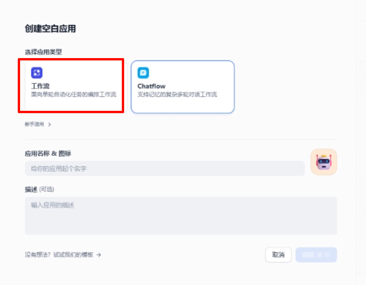 | 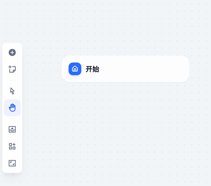 |

**2.3.2 认识节点和变量**

**节点**：工作流的功能单元。多个节点按顺序连接后，共同完成输入、判断、检索、生成和输出。

**变量**：节点之间传递的数据。上游节点的输出可以作为下游节点的输入。

所有节点列表

|  |  |
|:--:|:--:|
| **节点名称** | **说明** |
| 开始(Start) | 定义一个workflow流程启动的初始参数。 |
| 结束(End) | 定义一个workflow流程结束的最终输出内容。 |
| 回复(Answer) | 定义一个Chatflow流程中的回复内容。 |
| 大预言模型(LLM) | 调用大语言模型回答问题或者对自然语言进行处理。 |
| 知识检索(Knowledge Retrieval) | 从知识库中检索与用户问题相关的文本内容，可作为下游LLM节点的上下文。 |
| 问题分类(Question Classifier) | 通过定义分类描述，LLM能够根据用户输入选择与之相匹配的分类。 |
| 条件分支(IF/ELSE) | 允许你根据if/else条件将workflow拆分成两个分支 |
| 代码执行(Code) | 运行Python/NodeJS代码以在工作流程中执行数据转换等自定义逻辑。 |
| 模型转换(Template) | 允许借助Jinja2的Python模版语言灵活地进行数据转换、文本处理等。 |
| 变量聚合(Variable Aggregator) | 将多路分支的变量聚合为一个变量，以实现下游节点统一配置 |
| 参数提取器(Parameter Extractor) | 利用LLM从自然语言推理并提取结构化参数，用于后置的工具调用或HTTP请求。 |
| 迭代(Iteration) | 对列表对象执行多次步骤直至输出所有结果。 |
| HTTP请求(HTTP Request) | 允许通过HTTP协议发送服务器请求，适用于获取外部检索结果、webhook、生成图片等情景。 |
| 工具(Tools) | 允许在工作流内调用Dify内置工具、自定义工具、子工作流等。 |
| 变量赋值(Variable Assigner) | 变量赋值节点用于向可写入变量(例如会话变量)进行变量赋值 |
| 循环(Loop) | 循环节点用于执行依赖前一轮结果的重复任务，直到满足退出条件或达到最大循环次数。 |

**2.3.3 搭建 KnowledgeBase 示例流程**

以此为例：

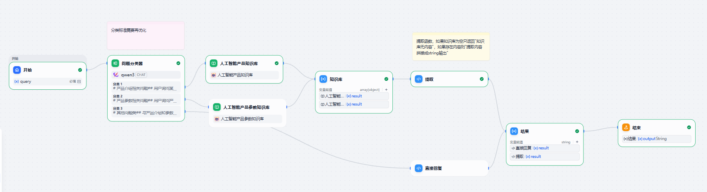

创建应用并输入清晰的名称，点击 **开始** 节点，新增用户问题输入字段/

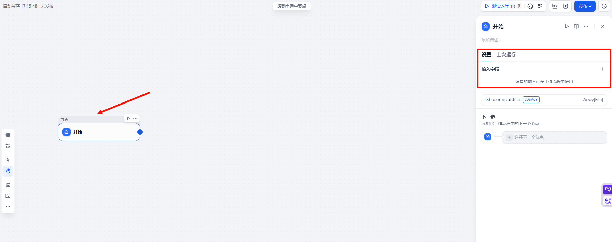

将变量名称设置为 query，显示名称可设置为“用户问题”。根据需求选择相关变量类型。

|  |  |
|:---|:---|
| 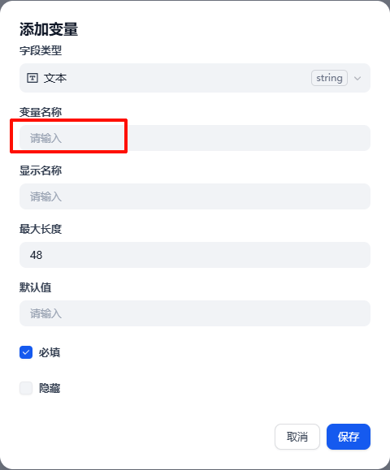 | 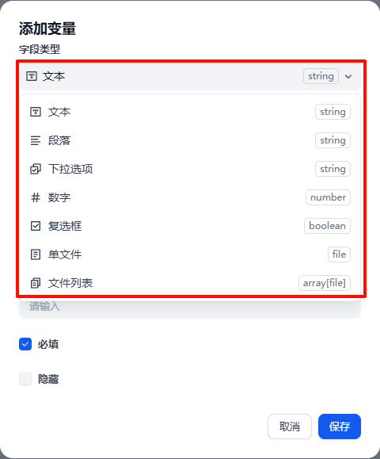 |

点击节点旁的加号，添加 **问题分类器**。点击加号，即可增加节点。

|  |  |
|:---|:--:|
| 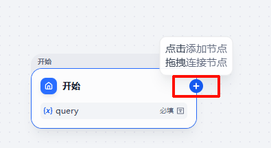 | 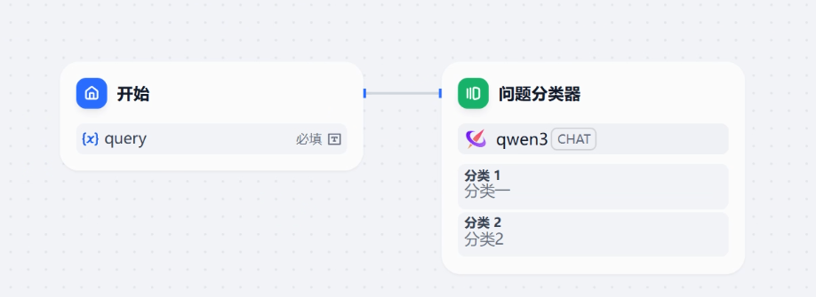 |

将分类器输入变量设置为 query，并根据业务需求编写互斥、清晰的分类标准。必要时为每个分类补充示例问题。

|  |  |
|:---|:---|
| 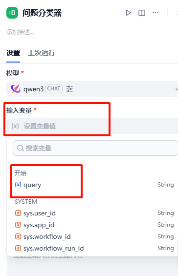 | 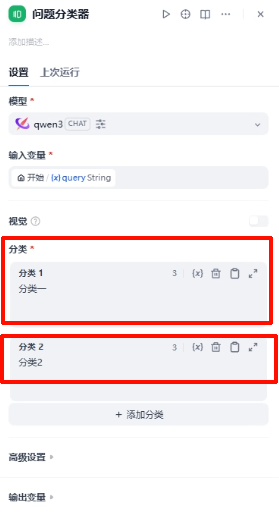 |

在需要查询资料的分支中添加 **知识检索** 节点，并选择已连接的 RAGFlow 知识库。

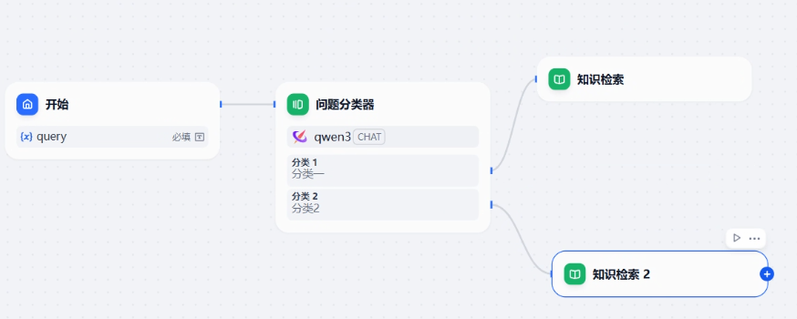

进行配置相应的知识库

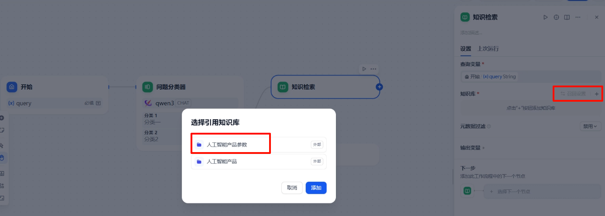

如果多个分支都会返回检索结果，可使用 **变量聚合器** 将结果合并为一个统一变量。

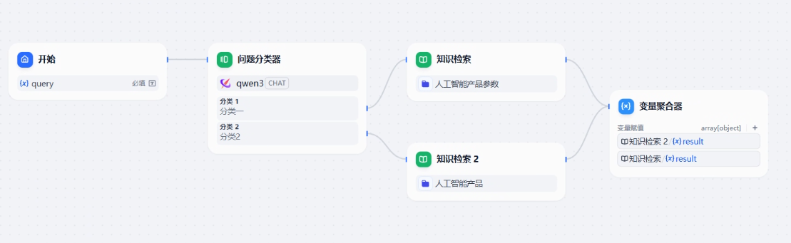

将上一节点和变量聚合器节点相连时选择所需的变量名称

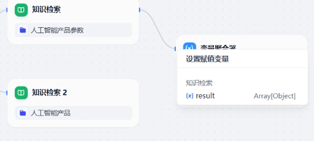

如聚合结果为 Array\[Object\]，可添加 **代码执行** 节点，将所需字段整理为字符串。代码应同时处理空结果和字段缺失情况。

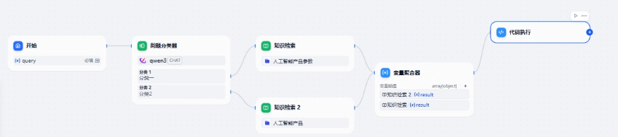

根据需要定义变量以及输出

|  |  |
|:---|:---|
| 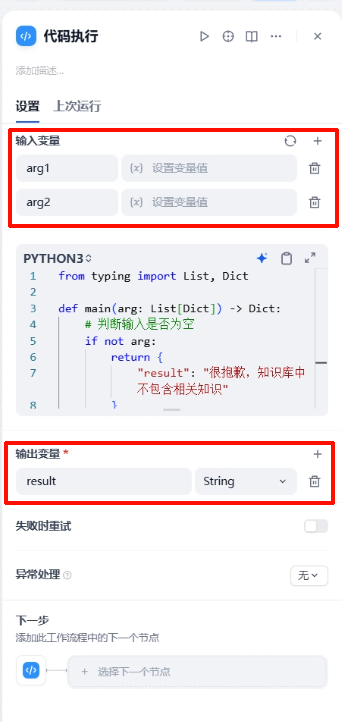 | 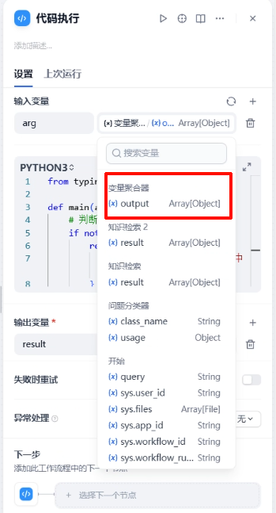 |

添加 **结束** 或 **回复** 节点，输出最终回答。

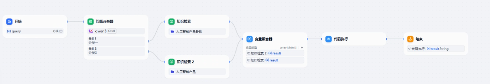

将代码执行获得的字符串输出

|  |  |
|:---|:---|
| 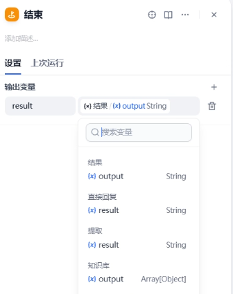 | 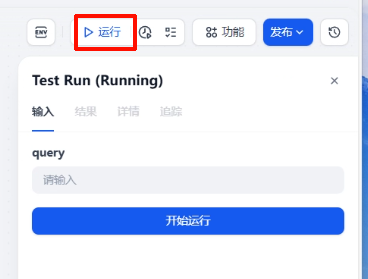 |

**2.3.4 测试与发布**

输入一个知识库中已有答案的问题，运行工作流测试。

检查各节点的输入和输出，确认分类、检索和回答均符合预期。

再输入一个知识库中没有答案的问题，确认系统不会编造答案，并能够给出明确提示。

测试通过后，点击 **发布更新**。

发布后，可根据需要通过 API 调用应用，或启用 MCP 服务。

|  |  |
|:---|:---|
| 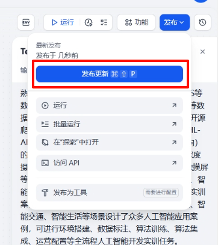 | 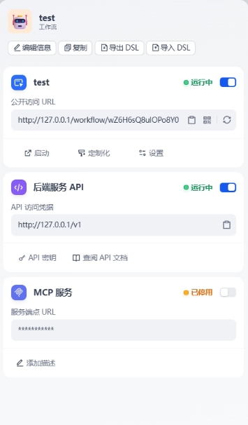 |

**2.3.5 启用 MCP**

MCP 是模型上下文协议（Model Context Protocol），用于让大语言模型以统一方式连接外部工具或服务。

打开应用的 MCP 配置页面。

启用 MCP 服务。

填写工具名称、功能描述和参数说明。

保存配置后，使用客户端进行连接测试。

工具描述应说明“工具能做什么”；参数描述应说明“参数名称、类型、是否必填和示例值”。描述越清晰，大语言模型越容易正确调用工具。

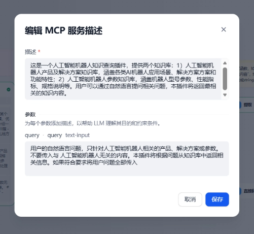

通过mcp工具将知识库搭建的工作流应用到pqvista，通过工具调用该知识库

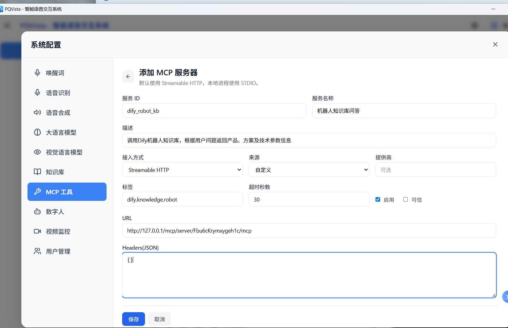

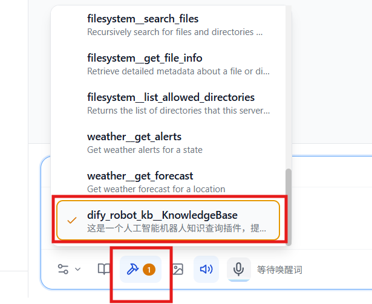
