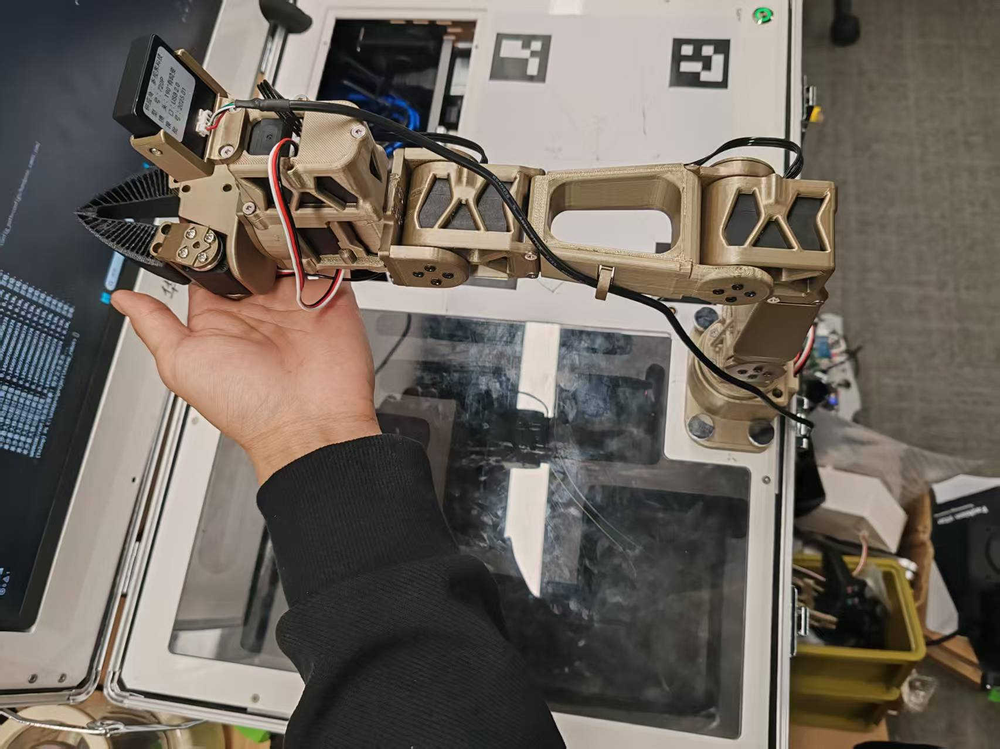
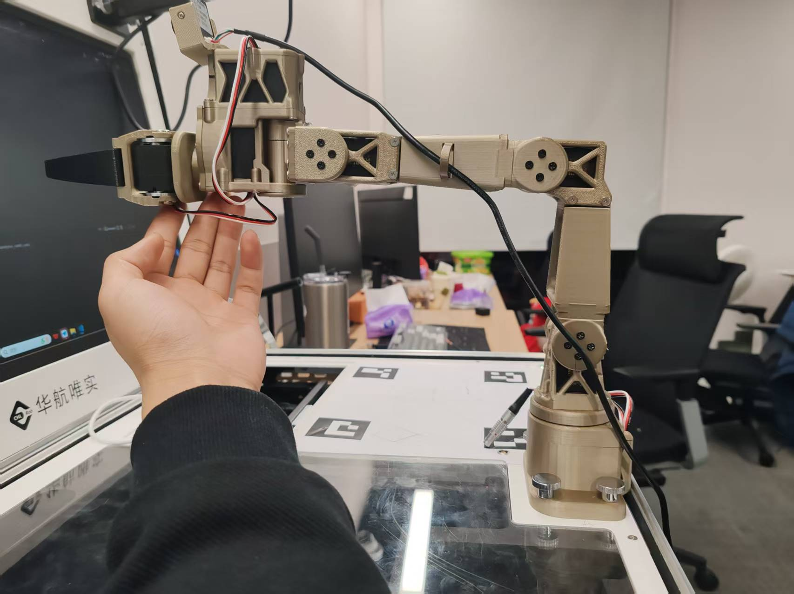
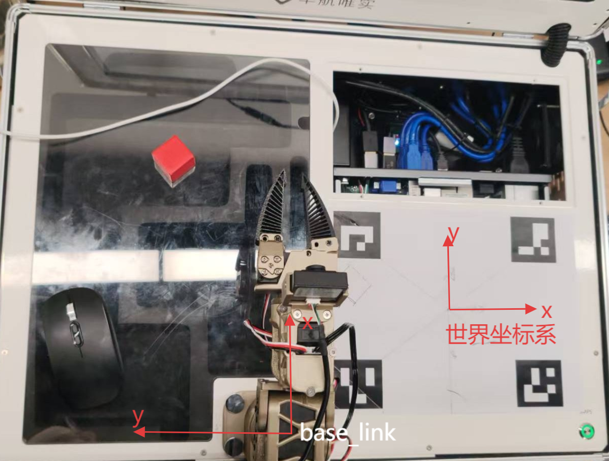

# AI02pro视觉引导抓取实验指导书

**AI02pro视觉引导抓取实验指导书**

_**大纲**_

机械臂视觉抓取的完整流程通常包括：首先在工作区域中放置目标物块，通过目标检测算法在图像中识别物体的位置与类别；随后结合相机标定结果，利用相机外参将物体从图像坐标系或相机坐标系映射到世界坐标系；接着根据相机与机械臂之间的安装标定关系，将物块在世界坐标系下的三维位置转换到机械臂的 base\_link 坐标系；机械臂根据转换后的目标坐标执行逆运动学求解，生成末端执行器的抓取轨迹，使夹爪能够准确到达物体并完成抓取；最终，机械臂将物体移动并放置到指定区域，动作完成后回到初始位置。

**一、相机标定**

此项目使用aruco码来定位，规定世界坐标系原点为四个aruco码组成的矩阵的中心点，x,y坐标见附录[世界坐标系与机械臂base\_link坐标系](https://gcnu7bienh0i.feishu.cn/docx/LBt0dHle0oUTJcx34gKc9dDknFg?fromScene=spaceOverview#doxcnr3zyPgTyNljRcfioOAPy9Y)，已知四个aurco码在世界坐标系下的位姿来求解相机在世界坐标系下的位姿，即相机外参。

**2.1 aruco码检测**

Aruco 码是一类类似二维码的人工标记，由黑白方形边框与内部编码构成。OpenCV 提供了稳定的 ArUco 检测工具，可返回每个标记的：

唯一 ID

四个角点的图像像素坐标

在本项目中使用 DICT\_4X4\_50 字典，并布置 ID 为 **1、2、3、4** 的四个标记在矩形板的四角：

> 1 ———— 2\
> \| |\
> 3 ———— 4

检测流程如下：

从 Orbbec 相机读取一帧图像 frame。

转为灰度图：

| 
Plain Text gray = cv2.cvtColor(frame, cv2.COLOR_BGR2GRAY)
 |
| ------------------------------------------------------------------- |

调用 ArUco 检测器：

| 
Plain Text corners, ids, _ = detector.detectMarkers(gray)
 |
| ------------------------------------------------------------------- |

若检测到的 ID 集合包含 {1,2,3,4}，即可用于计算外参。

每个 ArUco 的中心像素坐标通过 4 个角点平均得到：

$$
(ui,vi) = \frac{1}{4}\sum_{k = 1}^{4}{}(u_{ik},v_{ik})
$$

**2.2 计算相机外参**

**(1)世界坐标系定义**

将标定板定义为世界坐标系，平面为 Z=0，中心为原点。

若板宽度为 W、高度为 H，则四个角点的三维坐标为：

$$
P1 = ( - W/2, + H/2,0)
$$

$$
P2 = ( + W/2, + H/2,0)
$$

$$
P3 = ( - W/2, - H/2,0)
$$

$$
P4 = ( + W/2, - H/2,0)
$$

**(2) 相机内参矩阵**

通过相机 SDK 获取焦距与主点坐标，得到：

$$
K = \begin{bmatrix}
f_{x} & 0 & c_{x} \\
0 & f_{y} & c_{y} \\
0 & 0 & 1
\end{bmatrix}
$$

_注意：Gemini 336L相机通过sdk得到的图像已经去畸变，不需要计算相机内参_

**(3) 使用 PnP 求解相机位姿**

已知：

世界坐标点：

$$
P_{i} = (X_{i},Y_{i},Z_{i})
$$

像素坐标点：

$$
(u_{i},v_{i})
$$

PnP 模型满足：

$$
s\left\lbrack \begin{array}{r}
u_{i} \\
v_{i} \\
1
\end{array} \right\rbrack = K\left\lbrack Rt \right\rbrack\left\lbrack \begin{array}{r}
X_{i} \\
Y_{i} \\
Z_{i} \\
1
\end{array} \right\rbrack
$$

OpenCV 代码：

| 
Plain Text success, rvec, tvec = cv2.solvePnP(obj_pts, img_pts, K, None) R, _ = cv2.Rodrigues(rvec)
 |
| ---------------------------------------------------------------------------------------------------------------- |

**(4) 齐次变换矩阵**

世界坐标 → 相机坐标：

$$
T_{\text{cam} \leftarrow \text{world}} = \begin{bmatrix}
R & t \\
0 & 1
\end{bmatrix}
$$

相机坐标 → 世界坐标：

$$
T_{\text{world} \leftarrow \text{cam}} = T_{\text{cam} \leftarrow \text{world}}^{- 1}
$$

最终将

$$
R,t,Tcam \leftarrow world,Tworld \leftarrow cam
$$

保存至 camera\_extrinsics.npz。

**二、基于矩阵的坐标变换算法**

积木中心的像素坐标为 (u,v)，最终目标是将其转为机械臂基座坐标系下的三维坐标。

整个坐标变换链路如下：

$$
(u,v) \Rightarrow P_{c} \Rightarrow P_{w} \Rightarrow P_{b}
$$

**3.1 像素坐标 → 相机坐标系**

使用针孔模型：

$$
\begin{array}{r}
\lbrack\begin{array}{r}
x_{c} \\
y_{c} \\
1
\end{array}\rbrack = K^{- 1}\lbrack\begin{array}{r}
u \\
v \\
1
\end{array}\rbrack
\end{array}
$$

得到相机坐标系的一条射线方向向量：

$$
dc = \frac{K^{- 1}\lbrack u,v,1\rbrack^{T}}{\parallel K^{- 1}\lbrack u,v,1\rbrack^{T} \parallel}
$$

**3.2 相机坐标系 → 世界坐标**

方向向量转至世界坐标：

$$
dw = R_{\text{wc}}d_{c}
$$

相机光心在世界坐标中的位置：

$$
Cw = T_{\text{world} \leftarrow \text{cam}}(0,0,0)
$$

再与平面 Z=0 求交，得到积木位置：

$$
P_{w} = C_{w} + sd_{w},s = \frac{- C_{wz}}{d_{wz}}
$$

**3.3 世界坐标 → 机械臂基座坐标**

在机械臂标定时，记录世界坐标到基座坐标的转换矩阵：

$$
T_{\text{base} \leftarrow \text{world}} = \begin{bmatrix}
R_{bw} & t_{bw} \\
0 & 1
\end{bmatrix}
$$

于是积木在基座坐标系的位置为：

$$
P_{b} = T_{\text{base} \leftarrow \text{world}} \cdot \left\lbrack \begin{array}{r}
P_{wx} \\
P_{wy} \\
P_{wz} \\
1
\end{array} \right\rbrack
$$

**三、机械臂运动学**

**4.1 机械臂正运动学（Forward Kinematics）**

给定一组关节角：

$$
q = \lbrack q_{1},q_{2},\ldots,q_{n}\rbrack^{T}
$$

求末端执行器在基座坐标系的位姿：

$$
T_{\text{base} \leftarrow \text{ee}}(q) = T_{1}(q_{1})T_{2}(q_{2})\ldots T_{n}(q_{n})
$$

使用机器人 URDF 模型即可解析各关节的空间变换。

代码接口示例：

| 
Plain Text pose = solver.fk(q)
 |
| ---------------------------------------- |

**4.2 机械臂逆运动学（Inverse Kinematics）**

逆运动学求解：已知目标末端位姿 T\*，求关节角 q。

一般无解析解，因此使用数值迭代法：

$$
min_{q} \parallel T_{\text{base} \leftarrow \text{ee}}(q) - T^{\ast} \parallel
$$

在本项目中：

| 
Plain Text ok, q = solver.ik(q_current, target_pose)
 |
| -------------------------------------------------------------- |

流程：

以当前关节角

$$
q_{\text{current}}
$$

作为初始值；

迭代更新 q，使末端逼近目标位姿；

若误差足够小则求解成功。

求解成功后，通过插值函数 move\_step() 生成平滑轨迹，让机械臂平稳运动。

**四、基于深度学习的目标检测算法**

**1.1 数据集采集**

首先先安装好深度相机，如下图所示：

.jpeg>)

然后修改collect.yaml中的参数

train类型数据集采集20条，val类型数据集采集50条

| 
Plain Text dataset: name: "wukuai_det" # 数据集名称 split: "train" # train / val / test count: 50 # 需要采集多少张  camera: show: true # 是否显示原始窗口（CameraManager 内部）  save: root: "./datasets/raw" # 数据集根目录
 |
| ----------------------------------------------------------------------------------------------------------------------------------------------------------------------------------------------------------------------------------- |

运行数据采集脚本

| 
Plain Text conda activate teleop
 |
| ------------------------------------------ |

运行脚本

| 
Plain Text graspv-collect.exe --config_path=./configs/collect.yaml
 |
| ---------------------------------------------------------------------------- |

点击弹出的图像画面，放入物块，按s保存画面，将物块放置到不同的位置，可以一次放多个物块，训练集保存50张图片，测试集保存20张图片

.png>)

**1.2 数据集标注**

运行PQDLK程序启动标注工具

按照流程加载待标注数据集，并开启自动标注模式。以标注训练集为例

选择智能标注程序

.png>)

选择标注模型

推荐使用SAM2（segment anything 2)模型，选择输出为矩形框，点击+点。

.png>)

点击物块的大致位置，工具会自动标注物块，然后按f确认并手动选择标签

.png>)

导入数据集后，需要添加标签。点击"标签管理"后，弹窗中点击"新增标签"添加标签。每个标签可选择不同颜色。

.png>)

完成所有图像标注后，点击"导出数据集"可以将标注数据集转换成指定训练格式的训练数据集。

.png>)

点击"下载数据集"可以下载已导出的训练数据集。

.png>)

软件提供了批量导入标注数据集的功能，便于不同电脑之间共享标注数据集。点击数据管理页面的"导出数据集"。

.png>)

.png>)

**1.3 模型训练**

选择左侧导航栏训练管理图标进入训练管理界面。该模块提供训练项目卡片式管理、新建项目、打开项目、导入项目、导出项目、管理已部署模型等功能。

.png>)

点击"新建项目"图标，在弹出的窗口中填写项目名称、项目路径、项目类型、项目描述信息完成项目创建。

.png>)

创建完成后将弹出模型训练界面。

.png>)

点击“训练配置”，弹出训练参数配置窗口，提供了训练参数和图像增强参数配置。预训练权重提供了阆中导入方式：内置模型和从训练项目导入。内置模型使用软件内置的基于COCO开源数据集训练的模型权重，从训练项目导入则可以使用其他训练项目的权重。

.png>)

数据集配置支持内部数据集和外部导入，外部导入目前支持YOLO格式的目标检测和实例分割数据集。

.png>)

训练面板提供了训练信息和训练精度图表显示。

.png>)

不同模型尺寸对应的精度和运行速度，可根据硬件和使用场景选择合适的尺寸。

表1.1.1 二分类问题混淆矩阵

|         |      |         |            |           |        |          |
| :-----: | :--: | :-----: | :--------: | :-------: | :----: | :------: |
|   模型尺寸  | 输入尺寸 | 精度(mAP) |   速度(CPU)  |  速度(GPU)  | 参数量(M) | FLOPs(B) |
| YOLO11n |  640 |   39.5  |  56.1± 0.8 | 1.5 ± 0.0 |   2.6  |    6.5   |
| YOLO11s |  640 |   47.0  |  90.0± 1.2 | 2.5 ± 0.0 |   9.4  |   21.5   |
| YOLO11m |  640 |   51.5  | 183.2± 2.0 | 4.7 ± 0.1 |  20.1  |   68.0   |
| YOLO11l |  640 |   53.4  | 238.6± 1.4 | 6.2 ± 0.1 |  25.3  |   86.9   |
| YOLO11x |  640 |   54.7  | 462.8± 6.7 | 11.3± 0.2 |  56.9  |   194.9  |

（2）评估。

训练完成后需要根据验证集的相关指标评估本次训练的效果。训练结果文件夹生成的验证集相关的指标结果是在默认验证参数下生成的，如使用的置信度阈值为0.001，这显然与实际使用时不符，为了更准确地评估训练的效果，需要设置合适的置信度阈值。

（3）模型性能评估指标。

结合本实验，我们关注这些指标，包括混淆矩阵(Confusion Matrix)、精确率曲线(Precision Curve)、召回率曲线(Recall Curve)、mAP(Mean Average Precision)，因为它们能够全面评估目标检测模型的性能。

①混淆矩阵用于评估模型的分类能力，可以直观地看到每个类别的分类情况。每一行表示某个真实类别的样本，数值表示这些样本被预测为不同类别的比例。每一列表示某个预测类别，数值表示模型将各个真实类别误分类为该类别的情况。对角线上的值表示正确分类的样本数，可以用来观察哪些类别的分类效果较好。

②精确率曲线反映了不同类别在不同置信度下的 Precision（精确率）变化情况，见图4.1.45。精度曲线反映了不同类别在不同置信度下的精度的变化情况。在某个合适的置信度下，如果某些类别精度偏低，则需要分析是否是数据标注问题或数据量不够，抑或是该类别缺失与其他类别容易造成混淆。

③召回率曲线反映了不同类别在不同置信度下的召回率的变化情况。在某些场景中（如医学）注重高召回率，如果某些类别召回率偏低，同样需要分析造成低召回率的原因，从而进行针对性的改进。例如，该类别的样本是否不足；该类别是否与其他类别混淆严重；置信度阈值是否设定过高，导致模型遗漏了一些目标。

④mAP，即平均精度均值，用于衡量模型在检测目标时的分类和定位能力。它综合了Precision（精确率）和 Recall（召回率）的信息，并通过计算不同置信度阈值下的性能来反映模型的整体表现。mAP50 计算的是 IoU = 0.5 时的平均精度，用于衡量目标检测的基本性能。mAP50-95 计算的是 IoU 阈值从 0.5 到 0.95 之间（步长 0.05）的平均精度，相对更严格，更能全面衡量模型的检测能力。在实际应用中，mAP 是目标检测最常用的评估指标。如本实验的训练结果显示，所有类别的 mAP50 均在 0.95 以上，mAP50-95 均在 0.85 以上，说明模型在检测任务中的表现较好。

**1.4 模型测试**

点击测试tab按钮，调整检测阈值，选择测试图片或者视频流，点击开始测试，模型推理完成后将显示带检测结果的图片。

.png>)

**五、 项目运行**

**5.1 相机标定**

| 
Plain Text graspv-calib --config_path=./configs/aruco_calib.yaml
 |
| -------------------------------------------------------------------------- |

aruco\_calib.yaml:

| 
YAML save_path: "./calibration/camera/camera_extrinsics.npz"  aruco: rect_width: 0.19 # 标定板的长：19cm rect_height: 0.15 # 标定板的宽： 5cm required_ids: [1, 2, 3, 4] dict_type: "DICT_4X4_50"  camera: show: false # 是否开启相机预览
 |
| ---------------------------------------------------------------------------------------------------------------------------------------------------------------------------------------------------------------------------------------------------------- |

**5.2 机械臂标定**

| 
Plain Text lerobot-calibrate --config_path=./configs/calibrate_robot_left.yaml
 |
| ---------------------------------------------------------------------------------------- |

命令运行后，程序会检测当前是否已有校准文件，并且会检查校准文件参数与舵机写入的参数是否一致，不一致时会提示是否需要重新校准。根据终端提示分别校准中间位置校准和角度范围。

.png>)

中间位置校准

中间位姿是设置当前舵机位置为角度范围的中间值。分别将舵机移动到如下图所示的位置后，按下回车键。

|                                                                                   |                                                                                   |
| :-------------------------------------------------------------------------------: | :-------------------------------------------------------------------------------: |
|  |  |

角度范围校准

中间位置校准完成后，终端会显示当前1，2，3，4，5，7关节的角度值，并实时更新显示关节运动的最小值和最大值。此时需要分别按照关节顺序移动各关节到其最小值和最大值。

.png>)

**5.3 视觉引导抓取程序运行**

| 
Plain Text graspv-grasp --config_path=./configs/grasp.yaml
 |
| -------------------------------------------------------------------- |

grasp.yaml:

注：如果抓不准微调offsets的参数，above、down、up参数代表每个动作离目标点的偏移量。

place\_up、place\_down参数代表每个动作离机械臂base\_link的偏移量。

| 
YAML # 相机检测模型配置 model: weight_path: "D:/AI02P/ai02_pro_grasp/vision/yolo/outputs/detect/train/weights/best.pt" extr_path: "./calibration/camera/camera_extrinsics.npz" target_class_id: 2 conf_th: 0.5 iou_th: 0.6 show: true  # 世界坐标到机械臂基座坐标变换 base_transform: base_pos_world: [-0.18, -0.11, 0.0] # 机械臂基座在世界坐标系中的位置（单位：米） r_world_base: # 旋转矩阵，世界坐标系到机械臂基座坐标系的旋转 - [0, -1, 0] - [1, 0, 0] - [0, 0, 1]  # 机械臂配置 robot: home_pose: [0, 1.55, -1.55, 0, 0, 0, 0] #机械臂初始关节角度  # 抓取与放置的相对偏移（单位：米） offsets: above: [0.0, -0.10, 0.15] # 抓取前悬停 down: [0.03, -0.08, 0.0] # 抓取下降 # 关闭夹爪 up: [0.03, -0.08, 0.25] # 抓取上升 place_up: [0.2, 0.10, 0.25] # 放置位置上方 place_down: [0.2, 0.10, 0.07] # 放置位置下方 # 打开夹爪  #回到home点
 |
| ------------------------------------------------------------------------------------------------------------------------------------------------------------------------------------------------------------------------------------------------------------------------------------------------------------------------------------------------------------------------------------------------------------------------------------------------------------------------------------------------------------------------------------------------------------------------------------------------------------------------------------------------------------------------------------------------------------------------------------------------------------------------------------------------------------------- |

**附录**

**世界坐标系与机械臂base\_link坐标系**

**Urdf 模型查看器:**

**\[该类型的内容暂不支持下载]**
