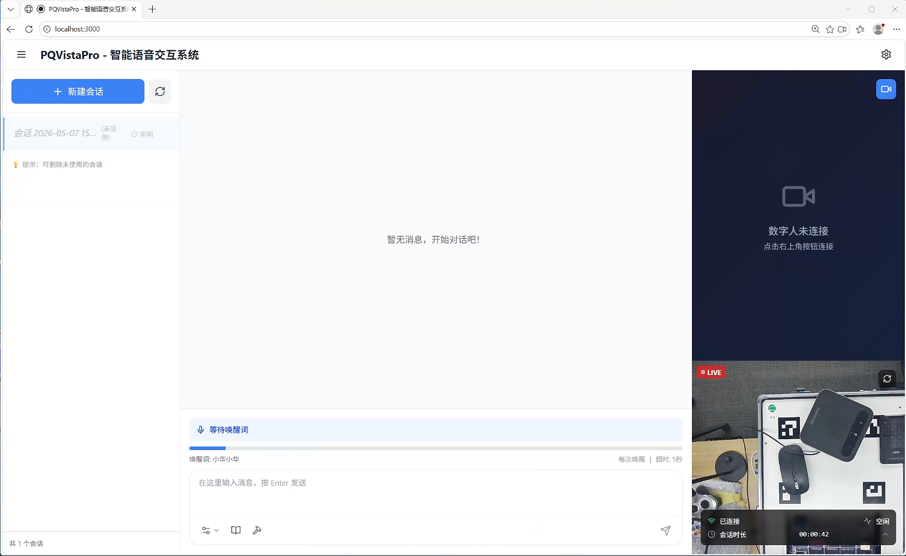
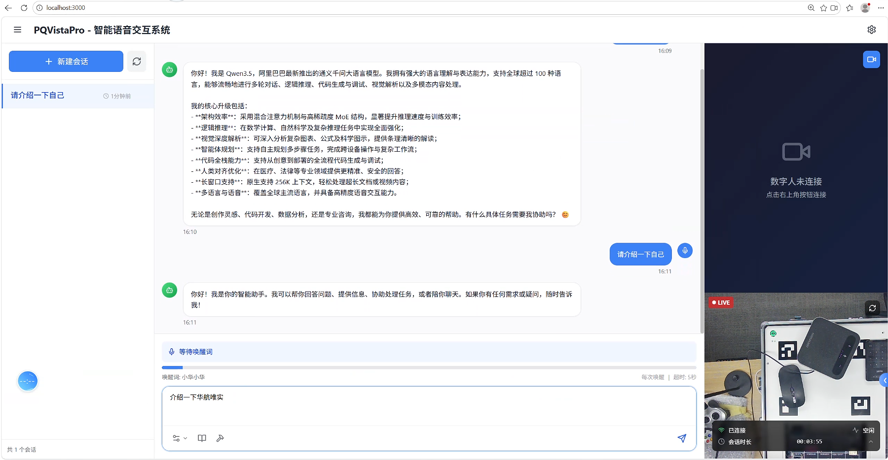
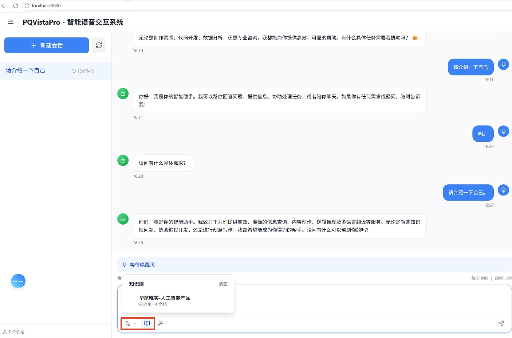
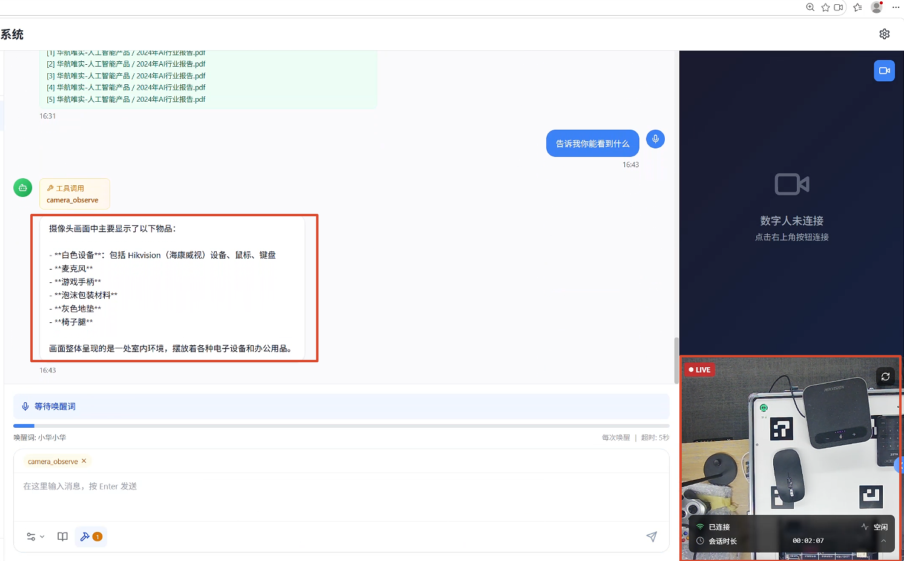
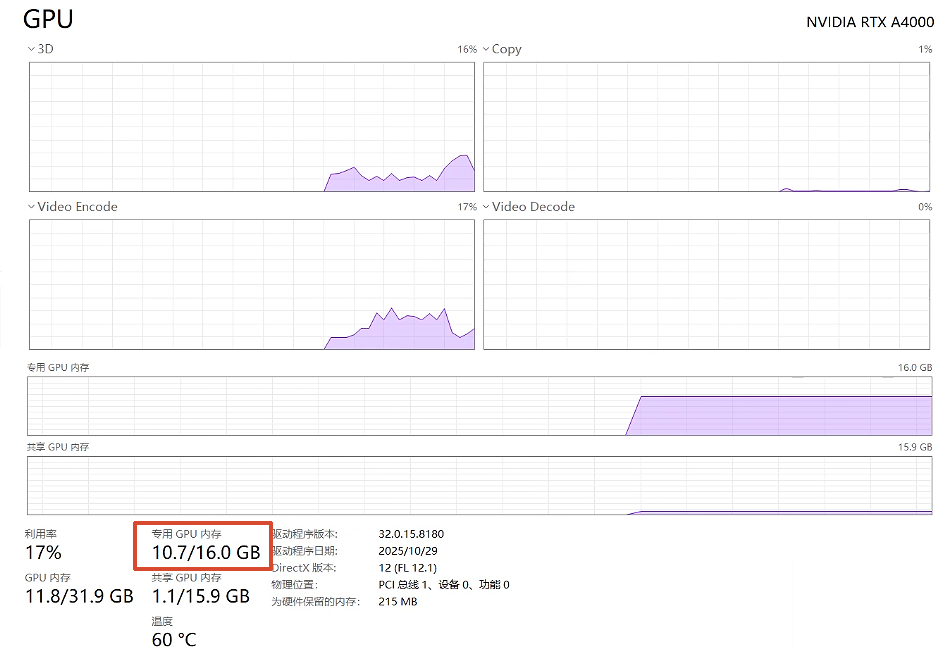
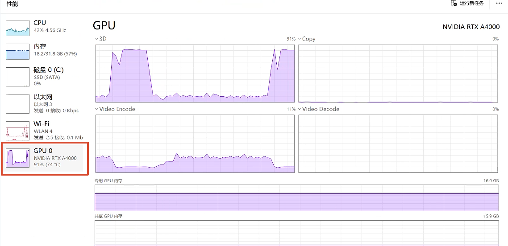
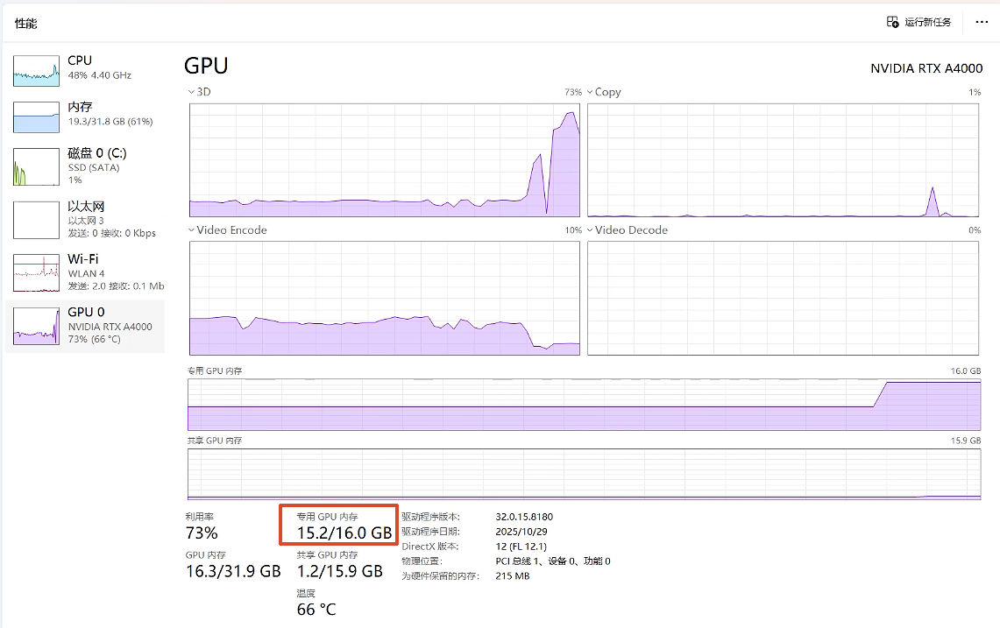
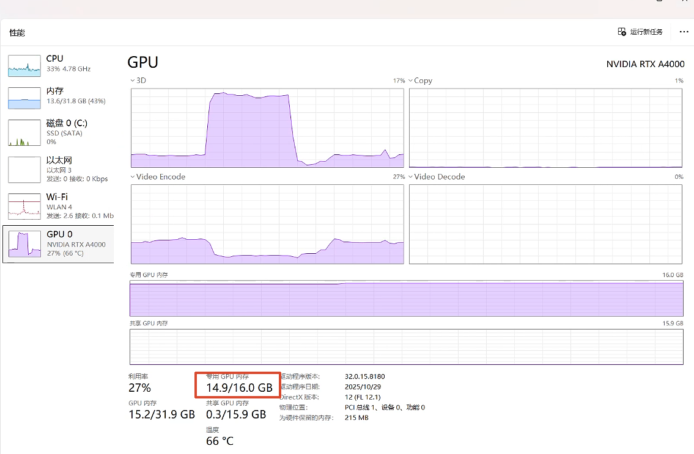

**PQVistaPro测试文档**

进入PQVistaPro主页面

提供两种交互方式

1\. **文字对话**

在对话框中直接输入即可

**1.1 添加知识库进行对话**

选择添加的知识库

输入想要问的问题

**1.2 添加mcp工具进行对话**

此系统内置一个mcp工具可以原生调用即读取当前摄像头查看有什么

选择工具，输入问题即可进行回答

2\. **语音对话**

需要先唤醒后进行对话，演示如下

**> 附：视频文件「20260507_162007.mp4」，请在 GitBook 中手动上传该文件。**

语音对话不需要选择知识库或者mcp工具，如果触发相关关键词去自动连接到相关工具进行回答，进行演示

**> 附：视频文件「20260507_170005.mp4」，请在 GitBook 中手动上传该文件。**

直接对话显存消耗大概在10.7g，此时跑了ragflow-cpu，ollama qwen3.5:9b

添加知识库进行对话显存的顶峰大概在14.5g左右，此时跑了ragflow-cpu，ollama (qwen3.5:9b，bge-m3)

添加mcp进行对话显存的顶峰大概在15.2g左右。此时跑了ragflow-cpu，ollama(qwen3.5:9b，qwen3-vl:4b)

如果是数字人对话，此时显存占用14.9g，同时实时性保证不了，此时跑了ollama(qwen3.5:9b) 数字人

